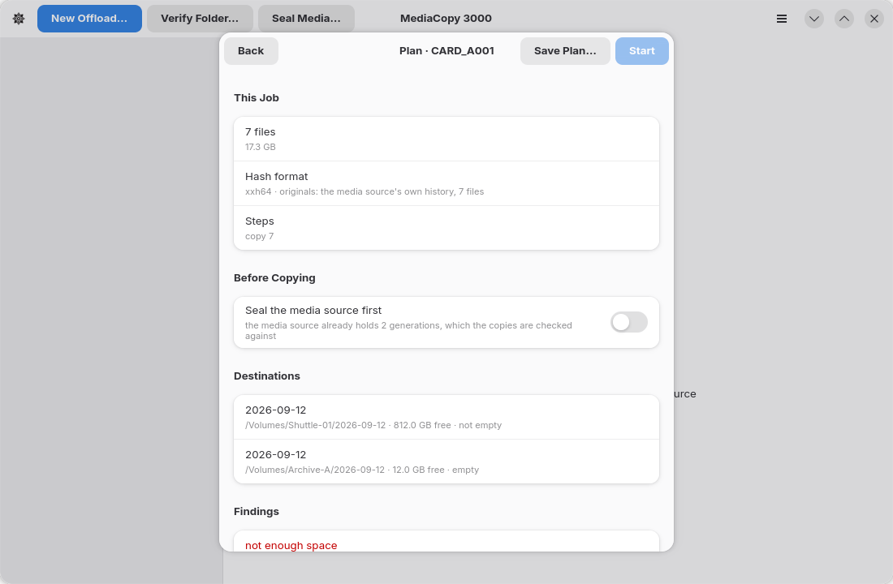

# Findings

A finding is something the plan learned that you must know. Every finding is a blocker or a warning.

- A **blocker** stops the job from starting. **Start** stays grey.
- A **warning** stops nothing.



Each finding has a code. The code is the same in the interface, in the report and in the tests, so
the three cannot disagree about what a finding is.

## Why a blocker is not a question

A blocker is not a question. The sheet has no button that accepts it. The job cannot start until the
cause is gone.

The blocker `destination holds files that are not on the media source` shows why. An offload writes
each file under a temporary name, and then renames it to its final name. If a write of a new file
fails, the job deletes both names. If a write over an existing file fails, the job deletes the
temporary name and keeps the old file. The job can promise this only for files it knows: the files
of the media source. A file it does not know can be lost, so the sheet refuses the folder.

## Blockers

| The sheet says | What it means | What to do |
|---|---|---|
| `source not found` | The media source is not at that path. | Mount it, or pick the path again. |
| `destination holds a partial copy` | The destination already holds some files of this media source. | Choose **Resume** or **Replace** under **Before Copying**. The page [Offloading a media source](offload.md) explains both. |
| `destination holds files that are not on the media source` | The destination holds a file, a folder or a generation that the media source does not hold. | Pick an empty folder, or a folder that does not exist yet. The detail names the first such file, folder or generation, in sorted order. |
| `destination was copied from another media source` | The destination carries a history whose generation does not agree with the media source's generation of the same name. | Pick another destination, or verify this folder with **Verify Folder…**. |
| `destination cannot be read` | The folder could not be read at all. | Check that the volume is mounted and that you can write to it. |
| `destination history cannot be read` | The destination holds an `ascmhl` folder, but its chain or a manifest it names could not be read. | Read the destination with another ASC MHL tool, or pick a different destination. |
| `not enough space` | The destination holds less free space than the job needs. | Free space, or pick another volume. |
| `hash format cannot be settled` | The records this job must check against hold more than one hash format. | Verify the folder in one format first, or offload to a fresh destination. |
| `chain names no manifest` | The chain file is there and names no generation at all. A seal that was taken has been lost. | Read the folder with another ASC MHL tool before you write anything else to it. |
| `chain cannot be read` | `ascmhl_chain.xml` is damaged or is not the file it claims to be. | Read the detail, which names the file and the parse error. |
| `a manifest the chain names cannot be read` | A manifest the chain names is gone, or is there and will not parse. | The detail names the file, and says `missing` or gives the parse error. |
| `folder has no history` | A verify job was given a folder with no `ascmhl` folder. | Seal the folder instead. Only a verify raises this. |

## Warnings

| The sheet says | What it means | What to do |
|---|---|---|
| `source is empty` | The media source holds no files. | Check that you picked the right folder. The job can run and will record nothing. |
| `folder is already sealed` | The media source already holds a generation, and this job would write another. | Turn off **Seal the media source first**, or use **Verify Folder…**. |

## Findings from plug-ins

A [plug-in](plugins.md) can add its own findings. Their text comes from the plug-in, after its name.
A plug-in can give a blocker only when you grant it `block`.

MediaCopy 3000 itself gives three findings about plug-ins:

| The sheet says | What it means | What to do |
|---|---|---|
| `plug-in unavailable` | The plug-in did not start, stopped, or gave no answer. The detail gives the reason. | Run `mediacopy3000 plan` and read its error output. Repair the plug-in, or set `enabled` to `false` in `plugins.json`. |
| `the field … has no valid value` | A setting or a job field of the plug-in has no value, or a value that the plug-in does not accept. | Give the value in `plugins.json`, or with `--plugin-field`. |
| `plug-in sent a bad answer` | The answer does not obey the protocol, for example metadata outside the namespace of the plug-in. | Tell the author of the plug-in. The detail gives the reason. |

Each of the three is a blocker for a contributor, and for an inspector that has the `block` grant.
For any other plug-in, it is a warning.

## Findings in the report

Every finding goes into the `Plan` block of the saved report, with its severity and its detail:

```
  warning: folder is already sealed – generation 2
```

The report keeps the warnings you accepted, so the decision stays with the record.
