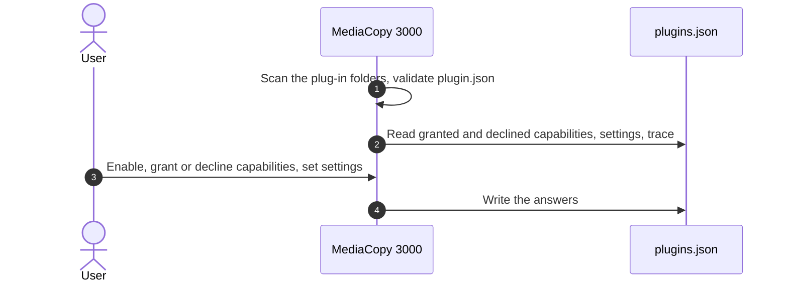
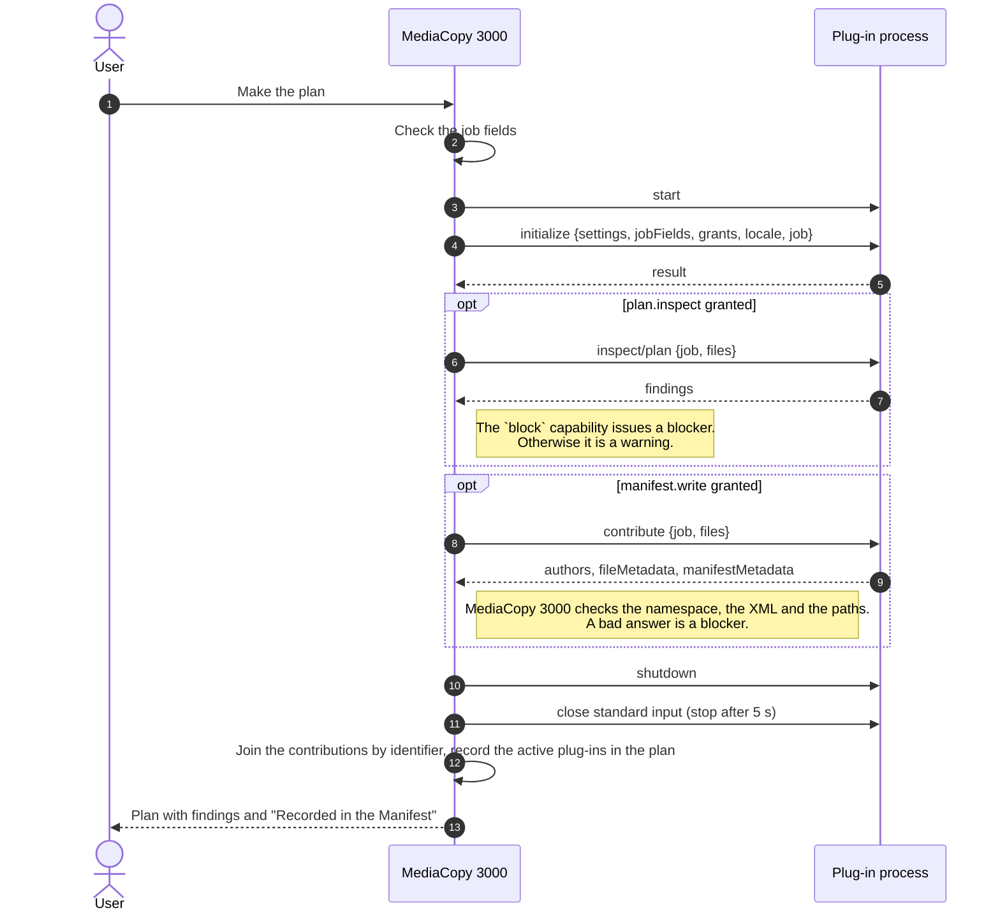
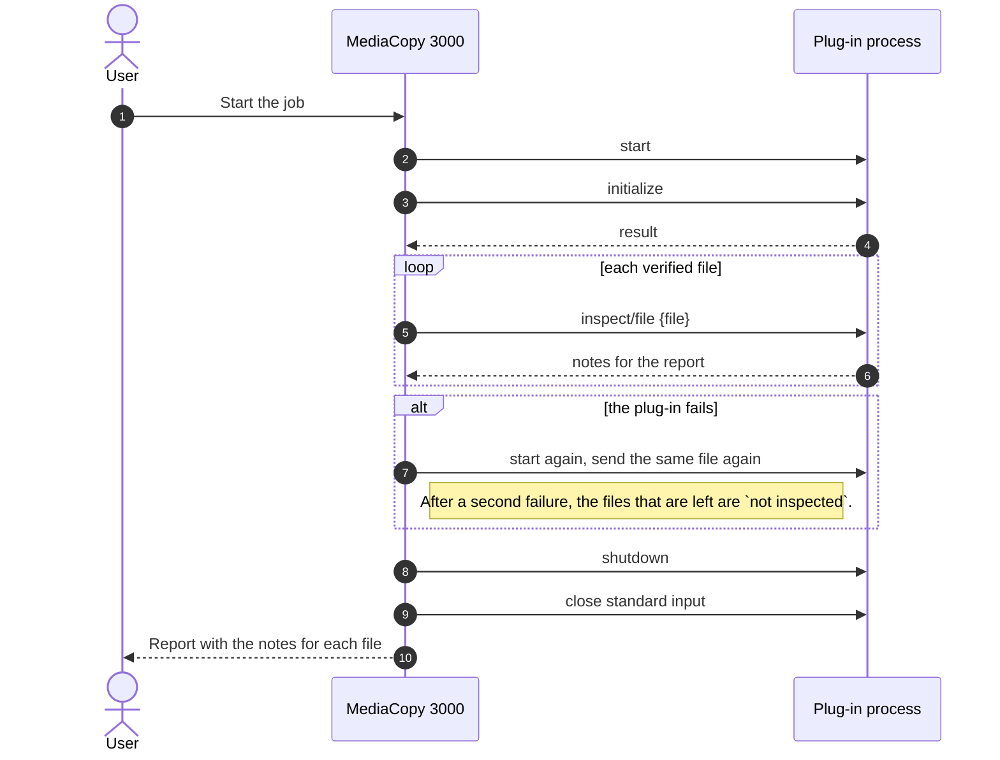
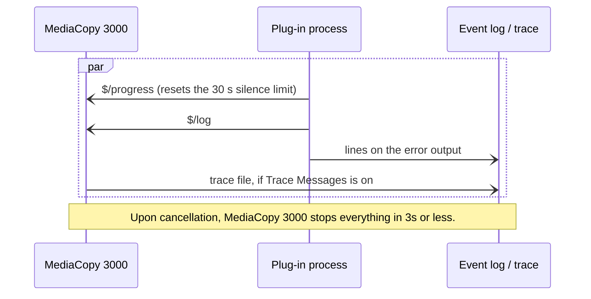

# Plug-ins

Plug-ins add functions to MediaCopy 3000 as separate programs.
You can control the plug-ins on the page **Plug-ins** of the preferences.

Plug-ins typically provide additional data to MediaCopy 3000, or interface with the files
without modifying them.

## What a plug-in can do

A plug-in asks for capabilities, which are permissions that MediaCopy 3000 lets it do.
The user can approve or decline the usage of those capabilities.

| Capability | When it runs | What it does |
|---|---|---|
| `files.read` | At any time | Reads the media files. |
| `plan.inspect` | When the plan is made | Adds findings to the plan. |
| `files.inspect` | After each file is verified | Adds notes about each verified file to the report. |
| `block` | With `plan.inspect` | Stops a job with a blocker. Without it, a blocker from the plug-in becomes a warning. |
| `manifest.write` | When the plan is made | Adds authors and metadata to each manifest that the job writes. |

## Install a plug-in

Each plug-in has its own folder, named after its identifier. The folder holds
a file `plugin.json` and the program. The identifier is a reverse domain name in
lowercase, for example `tech.floreal.credits`: it holds only `a` to `z`,
digits, `.`, `-` and `_`, at least one `.`, and no `..`, and it does not start
or end with `.`.

| System | Folder for your account | Folder for all accounts |
|---|---|---|
| Linux | `~/.local/share/mediacopy3000/plugins/<identifier>/` | `mediacopy3000/plugins/<identifier>/` in each folder of `XDG_DATA_DIRS`, for example `/usr/share` |
| macOS | `~/Library/Application Support/MediaCopy3000/Plugins/<identifier>/` | None. The folder in the app holds the plug-ins that come with MediaCopy 3000: refer to the next table. |
| Windows | `%APPDATA%\MediaCopy3000\plugins\<identifier>\` | `%PROGRAMDATA%\MediaCopy3000\plugins\<identifier>\` |
| Flatpak | `~/.var/app/tech.floreal.MediaCopy3000/data/mediacopy3000/plugins/<identifier>/` | The Flatpak extension `tech.floreal.MediaCopy3000.Plugin.<identifier>` |

Plug-ins that come with MediaCopy 3000 are in a different folder:

| System | Folder for plug-ins that come with MediaCopy 3000 |
|---|---|
| Linux | `lib/mediacopy3000/plugins/<identifier>/` beside the folder `bin` of the program, for example `/usr/lib/mediacopy3000/plugins/<identifier>/` |
| macOS | `MediaCopy3000.app/Contents/PlugIns/<identifier>/` |
| Windows | `%LOCALAPPDATA%\Programs\MediaCopy 3000\plugins\<identifier>\` |
| Flatpak | `/app/lib/mediacopy3000/plugins/<identifier>/` |

If two folders hold the same identifier, the folder for your account wins, and the folder of
plug-ins that come with MediaCopy 3000 loses. You can thus install a newer version of such a plug-in
for your account.

## Enable a plug-in


A plug-in that you install is off. It asks for capabilities, and you must answer each one.

1. Open the main menu and select **Plug-ins**.
2. Turn on the switch in the row of the plug-in.
3. Click the row of the plug-in. Its page opens.
4. In **Permissions**, for each capability, select **Granted** or **Declined**. MediaCopy 3000 does
   not send the requests of a declined capability.
5. In **Settings**, for each setting, type a value, then click the apply button at the right of the
   row.

To clear a setting, apply an empty value, or select **Not set**. The plug-in then gets the default
value of the setting, if it has one. The rows show the default values.

A plug-in runs only when each capability it asks for is granted or declined. A new version of a
plug-in that asks for a new capability stops until you answer it. The subtitle of the row tells why
an enabled plug-in does not run.

If you add or remove a plug-in folder while the preferences are open, click **Look Again**.

### The file `plugins.json`

MediaCopy 3000 keeps your answers and the settings in the file `plugins.json`. You can also edit
this file yourself, for example to install the same plug-ins on many computers.

1. Open the file `plugins.json`. Make it if it does not exist.

   | System | Path |
   |---|---|
   | Linux | `~/.config/mediacopy3000/plugins.json` |
   | macOS | `~/Library/Application Support/MediaCopy3000/plugins.json` |
   | Windows | `%APPDATA%\MediaCopy3000\plugins.json` |
   | Flatpak | `~/.var/app/tech.floreal.MediaCopy3000/config/mediacopy3000/plugins.json` |

2. Add an entry for the plug-in:

   ```json
   {
     "plugins": {
       "tech.floreal.credits": {
         "enabled": true,
         "grants": ["manifest.write"],
         "declined": [],
         "settings": {
           "authors": [
             {"role": "DIT", "name": "Jane Doe", "email": "jane@example.com", "phone": ""}
           ]
         }
       }
     }
   }
   ```

3. Put each capability that the plug-in asks for in `grants` or in `declined`.
4. Put a value for each setting of the plug-in in `settings`.
5. If the preferences are open, click **Look Again**.

MediaCopy 3000 keeps the keys of `plugins.json` that it does not know when it writes the file.

## The plug-in Credits

MediaCopy 3000 comes with the plug-in Credits, `tech.floreal.credits`. It puts the names of the
crew into each manifest that a job writes. Like each plug-in, it is off until you enable it and
grant `manifest.write`.

Credits has one setting, **Authors**. It is a list of author slots. Each slot has a role, and a
default name, email and phone. The role is required. The other values are optional.

To add a slot:

1. Open the page of **Credits**. In **Settings**, in the row **Authors**, click **Add**. A row
   **New author** appears.
2. Expand the row. Type the role, for example `DIT`, then click the apply button.
3. If the same person fills this slot on most jobs, type the name, the email and the phone.

To remove a slot, expand its row and click **Remove**.

For each job, the plan sheet asks for the name, the email and the phone of each slot, in the group
**Job Fields**. Each row starts with the default from the setting. An empty row keeps the default.
A slot with no name is not written.

The manifest then gets one `author` element for each slot that has a name, with its `role`, and
with the `email` and the `phone` when they are given. Credits writes no `metadata`.

Credits refuses a job when no slot has a name.

## What MediaCopy 3000 enforces

| Capability | What it allows | What MediaCopy 3000 enforces |
|---|---|---|
| `files.read` | Read the media files | Nothing. The plug-in promises it. |
| `plan.inspect` | Receive `inspect/plan` when the plan is made | Without this grant, MediaCopy 3000 does not send the request. |
| `files.inspect` | Receive `inspect/file` after each verified file | Without this grant, MediaCopy 3000 does not send the request. |
| `block` | Stop a job with a blocker | Without this grant, a blocker from the plug-in becomes a warning. |
| `manifest.write` | Receive `contribute` and add data to the manifest | Without this grant, MediaCopy 3000 does not ask the plug-in for data. |

A plug-in is a program that runs with your rights. MediaCopy 3000 cannot stop it from reading a file
or from opening a network connection. Install only plug-ins from a source that you trust.

## Job fields

A plug-in can ask for a value for each job, for example the name of the camera operator.

In the window, the plan sheet shows the group **Job Fields**, with one row for each field of each
enabled plug-in. Type the value, then click the apply button. MediaCopy 3000 makes the plan again
with the value. The page [The plan](the-plan.md) shows this group.

On the command line, give the value with `--plugin-field`:

```
mediacopy3000 plan offload SOURCE DEST --plugin-field tech.floreal.credits:authors.0.name="Sam Roe"
```

If a required job field has no value, the plan gives the finding
`the field authors has no valid value`. For a plug-in with `manifest.write`, or with `block` and
`plan.inspect`, this finding is a blocker. For any other plug-in, it is a warning, and the plug-in
does not run.

## When a plug-in fails

A plug-in fails when it does not start, stops, sends a bad answer, does not read a request, writes
a line longer than 16 MiB, or gives no sign of life for 30 seconds. A long task does not fail while
the plug-in reports its progress.

| When | Plug-in | Result |
|---|---|---|
| The plan is made | A plug-in with `manifest.write`, or with `block` and `plan.inspect` | A blocker. **Start** stays grey. |
| The plan is made | Any other plug-in | A warning. The plug-in does not take part in the job. |
| The plan is blocked | All | No plug-in starts for the job. |
| A file is inspected | A plug-in with `files.inspect` | MediaCopy 3000 starts the plug-in again and sends the same file again. After a second failure, the files that are left are `not inspected`. The job result does not change. |

When you cancel a job, MediaCopy 3000 stops each plug-in, and the programs that it started, in 3
seconds or less.

## Write a plug-in

A plug-in reads messages on its standard input and writes answers on its standard output. Each
message is one [JSON-RPC 2.0](https://www.jsonrpc.org/) object on one line. MediaCopy 3000 sends these requests:

| Method | When |
|---|---|
| `initialize` | First. It gives the settings, the job fields and the grants. |
| `inspect/plan` | When the plan is made, to a plug-in with `plan.inspect` |
| `contribute` | When the plan is made, to a plug-in with `manifest.write` |
| `inspect/file` | After each verified file, to a plug-in with `files.inspect` |
| `shutdown` | Last |

The plug-in can send the notifications `$/progress` and `$/log`. Lines on its error output go into
the event log of the job.

The file `plugin-protocol/schema/protocol-1.schema.json` in the source code describes each message
and `plugin.json`.

The file `plugin.json` has these keys:

| Key | Mandatory | Meaning |
|---|---|---|
| `id` | Yes | The identifier of the plug-in. The rules for an identifier are in "Install a plug-in". |
| `name` | Yes | The name that the preferences show. |
| `description` | Yes | One or two short sentences that tell what the plug-in does. The page of the plug-in shows it under the name. It cannot be blank. |
| `version` | Yes | The version of the plug-in, as text. |
| `api` | Yes | The major version of the plug-in API. It must be `1`. |
| `executable` | Yes | One path for each system: `linux-x86_64`, `linux-aarch64`, `macos-x86_64`, `macos-aarch64` and `windows-x86_64`. The rules for a path are in the list that follows. |
| `namespace` | With `manifest.write` | The only XML namespace that the plug-in writes. Refer to "Write into the manifest". |
| `capabilities` | Yes | The capabilities that the plug-in asks for: `files.read`, `plan.inspect`, `files.inspect`, `block` or `manifest.write`. At least one of `plan.inspect`, `files.inspect` and `manifest.write`. `block` needs `plan.inspect`. `manifest.write` needs `namespace`. |
| `settings` | No | The settings that the preferences show. Each setting has a `key`, a `label`, a `kind`, and can have `required` and `default`. A `choice` also has `options`. |
| `jobFields` | No | The fields that the plan sheet asks for each job. They have the same shape as the settings. |

A plug-in that breaks one of these rules is not valid. The group **Not Valid** shows the reason.

A setting has a kind: `text`, `secret`, `bool`, `choice`, `path` or `authors`. The kind `authors`
is a list of author slots that the user edits in the preferences. MediaCopy 3000 accepts it only
in `settings`, only once, only with `manifest.write`, and without `default`. The plan sheet asks for
the name, the email and the phone of each slot. `initialize` gives the merged list in `settings`,
without the slots that have no name. The plug-in returns these slots as `authors` in `contribute`.

The folder `plugins/credits` in the source code holds the plug-in Credits. It is a complete plug-in
in Haskell, built with the library `plugin-protocol`, under the BSD 3-Clause License. Copy it to start
a new plug-in.

A plug-in must obey these rules:

- It stops when its standard input closes.
- It reads each request. MediaCopy 3000 stops a plug-in that does not read a request in the time
  limit of the call.
- It writes lines of 16 MiB or less.
- It gives the same answer to `inspect/plan` and `contribute` for the same job. MediaCopy 3000 makes
  a queued plan again when its turn comes, and a different answer sends the job back for review.
- It writes metadata only in the XML namespace that its `plugin.json` declares. This namespace
  cannot be empty, a namespace of ASC MHL, or a namespace that XML reserves. The metadata has at
  most 32 levels of elements and only characters that XML 1.0 allows. MediaCopy 3000 removes XML
  comments and processing instructions.
- It writes in an author only characters that XML 1.0 allows.
- Each path in `executable` is relative to the folder of the plug-in. It does not start with `/` or
  `\`, holds no `:`, and has no `..` part. One bad path, for any system, makes the plug-in not
  valid on every system.

MediaCopy 3000 replaces each control character and line break in a text from a plug-in, such as a
title, a label or a log line, with a space.

The event log of a job holds at most 1,024 lines that wait to be written. While it is full, new
lines are lost, and lines of MediaCopy 3000 too. A plug-in that writes many lines at once can thus
make the log lose lines.

These diagrams show the messages between MediaCopy 3000 and a plug-in, one for each phase.

### Discovery

MediaCopy 3000 finds the plug-ins and records your answers before any job:



### Plan stage

When the plan is made, MediaCopy 3000 starts one session with each plug-in that has a hook:



### Run stage

When the job runs, MediaCopy 3000 starts again only the plug-ins with `files.inspect` that are
active in the plan:



### At any time

At any time while the plug-in runs, in both phases:



### Write into the manifest

A plug-in with `manifest.write` in `plugin.json` adds data to each manifest that the job writes.
MediaCopy 3000 asks for this data when it makes the plan, with the request `contribute`. It asks
only if you granted `manifest.write`.

The request gives the job: its kind, its source, its destinations, its hash format if it has one,
and the path and size of each file. The settings and the job fields come before, in `initialize`.

The answer holds three parts:

- `authors`: a list of authors. Each author has a `name`, and can have an `email`, a `phone` and a
  `role`.
- `fileMetadata`: a list of entries. Each entry has the `path` of a file of the job and an `xml`
  fragment for this file.
- `manifestMetadata`: one XML fragment for the manifest, or nothing.

MediaCopy 3000 checks the answer:

- Each text of an author holds only characters that XML 1.0 allows.
- Each fragment is in the namespace of the plug-in. The rules for metadata in the list that precedes
  apply.
- Each path in `fileMetadata` is a file of the job.

If one check fails, or if the plug-in does not answer, the plan gets a blocker, and **Start** stays
grey. A plug-in with `manifest.write` never takes part in a job with partial data.

MediaCopy 3000 then joins the answers of all plug-ins with `manifest.write`, in the order of their
identifiers. The authors go one after the other. The fragments for one file, or for the manifest, go
one after the other.

The plan sheet shows the result in the group **Recorded in the Manifest**: one row for each author,
and one row for the metadata, with the names of the plug-ins that add it. `mediacopy3000 plan`
writes the same data as `author` and `metadata` lines. The data of the plan is the data that the job
writes. The job does not ask the plug-in again.

### Trace the messages

To see each message between MediaCopy 3000 and a plug-in, turn on **Trace Messages** on the page of
the plug-in. The key `"trace": true` in `plugins.json` does the same.

Each start of the plug-in then makes one file in this folder:

| System | Path |
|---|---|
| Linux, macOS | `~/.local/state/mediacopy3000/plugin-traces/` |
| Windows | `%LOCALAPPDATA%\mediacopy3000\plugin-traces\` |
| Flatpak | `~/.var/app/tech.floreal.MediaCopy3000/.local/state/mediacopy3000/plugin-traces/` |

The name of the file is `<identifier>-<date>_<time>-<stage>-<pid>.jsonl`. The stage is `plan` or
`run`. A plug-in that MediaCopy 3000 starts again gets a new file.

Each line of the file is one JSON object:

- `time`: the time in UTC, to the millisecond.
- `dir`: `out` for a message to the plug-in, `in` for a line on its standard output, `stderr` for a
  line on its error output.
- `message`: the line, if it is JSON. Otherwise `text` holds the line as text.

MediaCopy 3000 does not delete trace files. Turn off **Trace Messages** when you do not need it. A
trace that cannot be written adds one line to the event log of the job, and the plug-in runs on.

## Ship a plug-in

Give the plug-in as one folder that holds `plugin.json` and the programs for each system that it
supports. The name of the folder is the identifier of the plug-in.

For the Flatpak version of MediaCopy 3000, ship the plug-in as a Flatpak extension:

1. Give the extension the identifier `tech.floreal.MediaCopy3000.Plugin.<identifier>`, for example
   `tech.floreal.MediaCopy3000.Plugin.tech.floreal.credits`.
2. Install `plugin.json` and the program at the root of the extension.
3. Build the program for the runtime `org.gnome.Platform`, version 49.

A Flatpak identifier allows the character `-` only in its last part, and no part can start with a
digit. If the identifier of the plug-in breaks these rules, it cannot be the name of an extension.
Then ship the folder, and tell the person to put it in the folder for the account.

The extension appears in the sandbox as the folder `/app/share/mediacopy3000/plugins/<identifier>/`.
The runtime holds Python 3. A program in Python can thus run with no other files.
