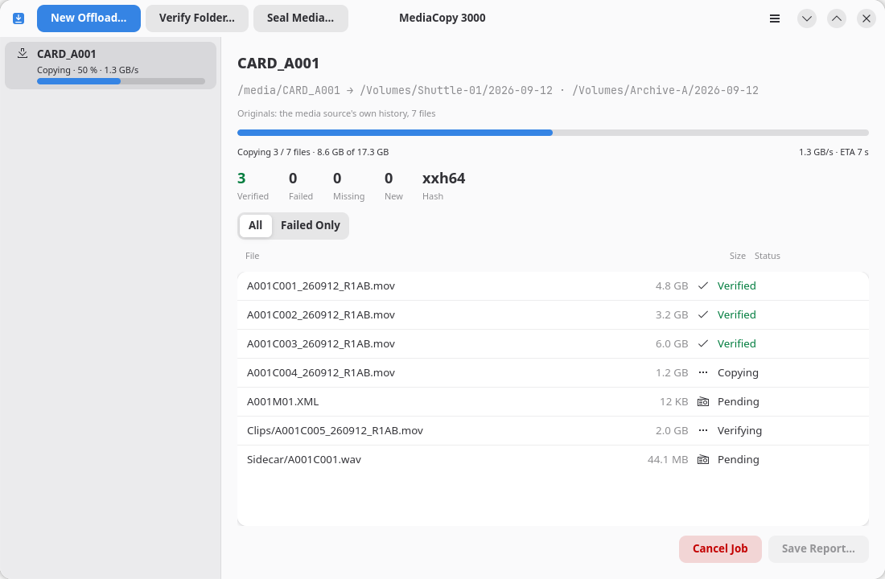
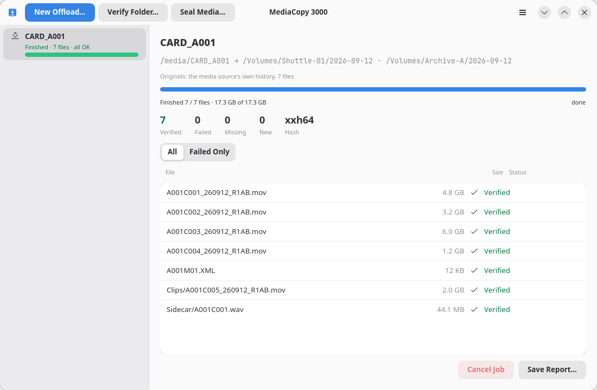
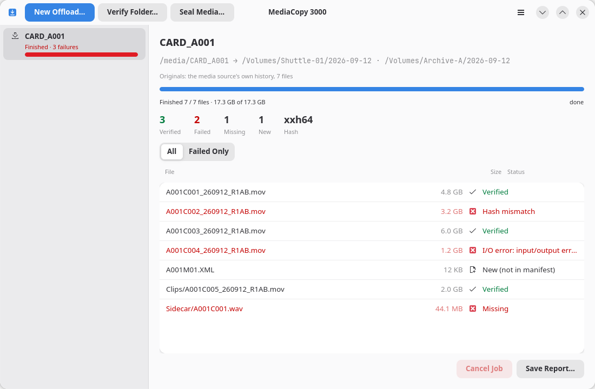
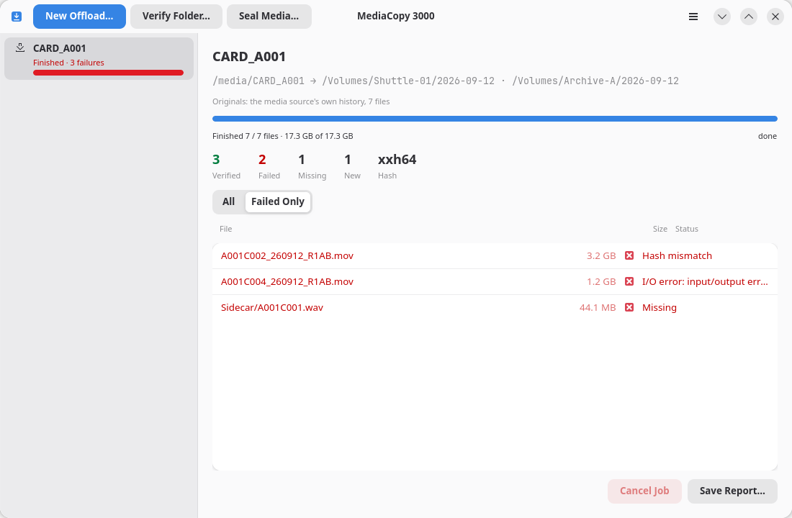
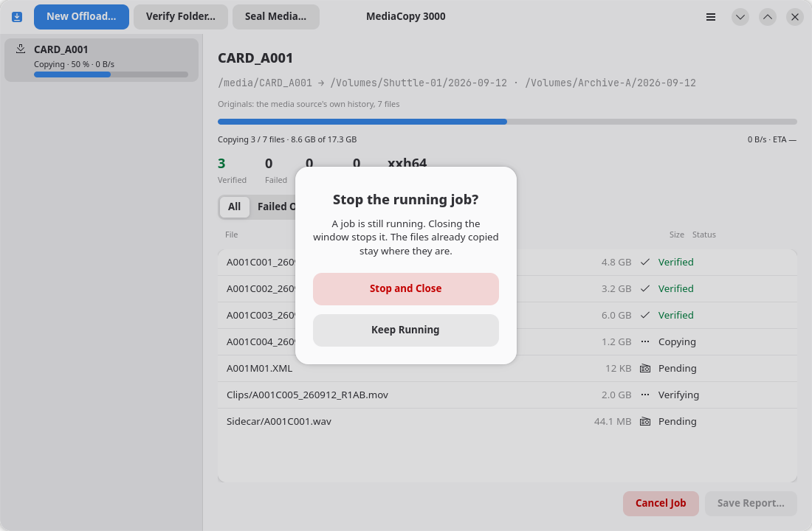

# While a job runs

## The top of the pane

The first line is the name of the folder the job reads. The line under it is the path or paths:

- An offload shows `<media source> → <destination> · <destination>`.
- A verify or a seal shows `<folder> · ascmhl/ chain: 3 generations`.

An offload also shows an `Originals:` line. It names the hashes this job checks its copies against.

## Progress

The bar is bytes alone. The line under it gives both: the files done of the files planned, then the
bytes done of the bytes planned.

The byte total counts the reads the plan can know. An offload reads each file to copy it, then reads
each copy back to compare it. A job that seals before it copies reads the media source one more time.
A job that continues an earlier copy also reads each file that is already at the destination.

One read is not in the total. If a file at the destination does not agree with the media source, the
job copies that file again and reads the new copy back. No plan can know this before it starts, so
the bar can stay at 100 % while the job completes that file.

At the right of that line, a running job shows its rate and an estimate of the time left. The
estimate is the bytes that are left divided by the measured rate. It moves when the rate moves.

Two parts of a copy move no byte. The disk takes the bytes the job wrote, and the job gives the copy
its final name. The application cannot measure a rate across either part.

The same place then shows the state of the file and a time, as `Saving to disk · 14 s`. The time
counts up from the last sign of movement. It appears after two seconds.

A time that counts up is not a fault. A large file on a slow disk stays in `Saving to disk` for many
seconds. A time that goes past several minutes tells you to examine the disk.

The job shows this time while it holds a file, and while it writes a manifest. Between two files,
and before the first file while the job reads the originals, no time is shown.

A job writes a manifest to each destination at its end, and a job that seals first also writes one
to the media source. It waits for the disk to take each manifest. That wait can be long on a slow
disk, and the line reads `Writing the manifest · 25 s`.

## The counters

| Counter | What it counts |
|---|---|
| `Verified` | Files that agreed with a hash that already existed |
| `Failed` | Files whose hash did not match, and files that could not be read |
| `Missing` | Files the history names that the disk does not hold |
| `New` | Files on the disk that no manifest names |
| `Hash` | The hash format this job uses |

`Verified` turns green and `Failed` turns red as soon as either passes zero.

## The file list

One row for each file: the name, the size, and the state.

| State | What it means |
|---|---|
| `Pending` | The job has not reached this file yet. |
| `Hashing` | The job reads the file to hash it. |
| `Copying` | The job writes the file to a destination. |
| `Saving to disk` | The job waits for the disk to take the bytes it wrote. |
| `Naming the copy` | The job gives the copy its final name. |
| `Verifying` | The job reads a copy back to compare it. |
| `Verified` | The hash matched the record. |
| `Hash mismatch` | The hash did not match the record. The file is not the file the record names. |
| `Missing` | A manifest names this file. The disk does not hold it. |
| `New (not in manifest)` | The disk holds this file. No manifest names it. |
| `I/O error: …` | The file could not be read. The message comes from the operating system. |
| `Replaced after mismatch` | The file was already at the destination, but its hash differed. The job copied it again. |

The **All** and **Failed Only** buttons filter the list. Use **Failed Only** on a large media
source, where three bad files sit among four hundred good ones.

## Cancel a job

**Cancel Job** stops a job that is queued, running or waiting for review. The files that were already
copied stay where they are.

You can offload into the same destination again. The page [Offloading a media source](offload.md)
explains it.

## Save the report

**Save Report…** is live once the job has ended. It writes a text file that records what the job
did, including the plan you approved. The page [Reports](reports.md) explains every line of it.

The page [The command line](command-line.md) prints a plan without the window.

## Close the window while a job runs

The window never closes itself while a job runs. It asks first.

- **Keep Running** leaves the job alone.
- **Stop and Close** stops the job and closes the window. The files already copied stay where they
  are.
