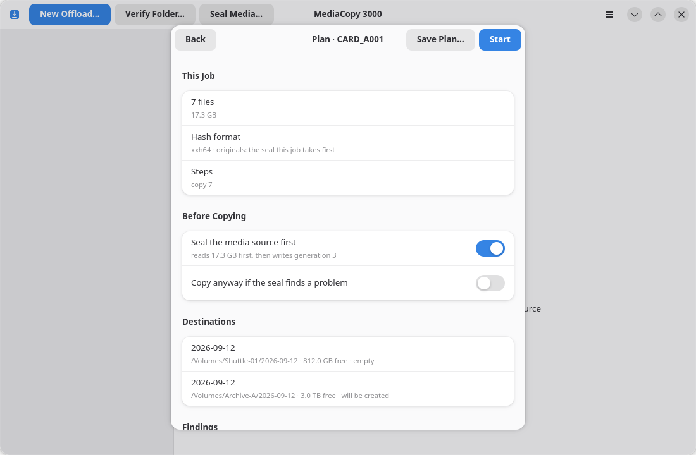

# Seal the media source first

The **Before Copying** group of the plan sheet holds two switches:
**Seal the media source first** and **Copy anyway if the seal finds a problem**.

A seal hashes the media source where it stands and records each file as `original`. The offload then
compares each copy against that record. The job records a copy that agrees as `verified`. If the media
source no longer matches its seal, the job records that file as `failed`.

## Seal the media source first

| Switch | What the job does |
|---|---|
| On | Read the whole media source and record its hashes. Then copy. |
| Off, and the media source holds a history | Check the copies against the generations it already holds. |
| Off, and the media source holds no history | Copy with nothing to check against. The job records every file as `original`. |

The switch costs a full read of the media source. The subtitle of the row says how many bytes that
is, and which generation the seal will write.

Turn it on for a media source that comes straight out of a camera and holds no history. Leave it off
for one that was sealed already, because a second seal records nothing that is new. The plan warns
you with `folder is already sealed` in that case.

A change to either switch computes the plan again, under the same job. You can never approve a plan
that belongs to the setting you left.

## Copy anyway if the seal finds a problem

The sheet shows this second switch only while the first one is on. It says what the job does when
the seal pass itself records a failure, for example a file the media source can no longer read.

| Switch | What the job does |
|---|---|
| Off | Stop before copying. The job writes nothing to any destination. |
| On | Copy anyway. The failure stays in the record. |

Off is the safe answer, and it is the one the sheet starts with. The job then fails with
`the seal failed for N of M files; nothing was copied`.

Turn it on when the media source is damaged and a partial copy is better than none. The manifest
records which files failed, so the record still says what happened.
