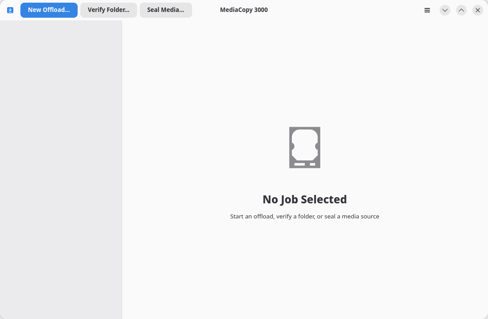
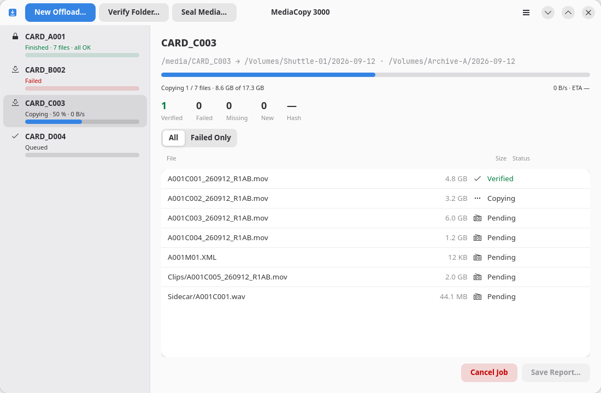

# The main window

The main window has three parts: the header bar, the job list and the detail pane.

## The header bar

Three buttons sit at the left and start one kind of job:

| Button | What it starts |
|---|---|
| **New Offload…** | An offload. The page [Offload a media source](offload.md) explains it. |
| **Verify Folder…** | A verify. The page [Verify a folder](verify.md) explains it. |
| **Seal Media…** | A seal. The page [Seal a media source](seal.md) explains it. |

The menu button sits at the right, which you can open with the <kbd>F10</kbd> key.

## The job list

The list at the left holds the jobs, one per row, their phase and a progress bar.

| The row says | What it means |
|---|---|
| `Queued` | The job waits for its turn. One job runs at a time. |
| `Needs review` | The job was planned again and the plan changed. The plan sheet waits for your answer. |
| `Copying · 42 % · 310 MB/s` | An offload runs. The number is the bytes done of the bytes planned, then the rate. |
| `Writing the manifest · 25 s` | The job read or wrote every file. It now writes its manifest. The number is the time it waited for the disk. |
| `Saving to disk · 14 s` | The job moved no byte for some seconds. The words name the state of the file in hand, and the number is the time in it. The page [While a job runs](running-a-job.md) explains it. |
| `Verifying…` | A verify runs. |
| `Sealing…` | A seal runs. |
| `Finished · 7 files · all OK` | Every file agreed. The line turns green. |
| `Finished · 2 failures` | Some files did not agree. The line turns red. |
| `Failed` | The job stopped before its end. A message at the bottom of the window gives the reason, and the report keeps it. |
| `Cancelled` | You stopped the job. |

Click a row to select the job. <kbd>Ctrl</kbd>+<kbd>Page Down</kbd> and
<kbd>Ctrl</kbd>+<kbd>Page Up</kbd> move the selection.
The [Keyboard Shortcuts](keyboard.md) page lists every key.

## The Details pane

The central view shows the selected job.
The page [While a job runs](running-a-job.md) explains each part of the pane.
