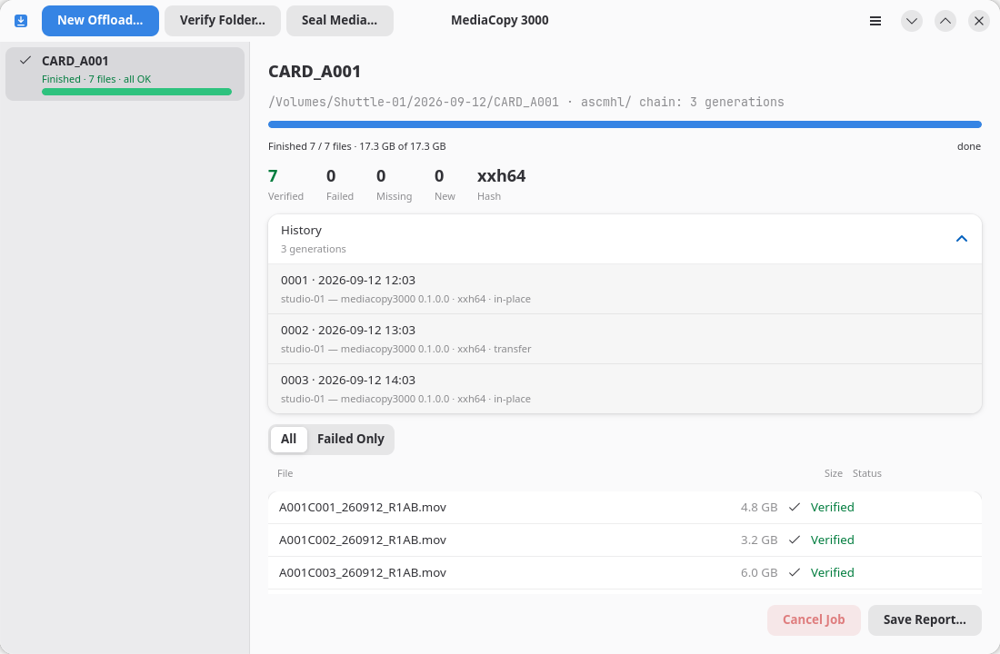

# Verify a folder

A verify job reads a folder again and checks every file against the folder's own history. It writes
one new generation that records the result.

## Start one

1. Click **Verify Folder…**, or press <kbd>Ctrl</kbd>+<kbd>O</kbd>.
2. Select the folder.
3. Read the plan, then click **Start**.

Pick the folder that holds the `ascmhl` folder. For a destination that an offload wrote, that is the
folder named after the media source, not the destination above it.

## What it needs

A verify job needs a history. A folder with no `ascmhl` folder gets the blocker
`folder has no history`, and the job cannot start. Seal the folder instead. The page
[Seal a media source](seal.md) covers that.

## What it uses to hash

A verify job does not choose its hash format. It takes the format from the manifest it checks
against, so a folder recorded in `md5` is read again in `md5`. MediaCopy 3000 reads `md5`, `sha1` and
`xxh64`.

## What the result means

| Result | What it proves |
|---|---|
| `Finished · N files · all OK` | Every file the manifest names is there, and its bytes still hash to what the manifest says. |
| `Finished · N failures` | A file did not match, could not be read, or is gone. The list names each one. |

A clean verify proves that the files agree with the manifests. It does not prove that the copy was
complete when it was made. A file that was never copied has no record in the manifest, so there is
nothing for a verify to miss. The page [Limits](limits.md) says more about this.

## What it writes

A verify job appends one generation to the folder's own history. The generation records the
`in-place` process, because nothing moved. The specification has no `verify` process.

The failures go in the record too. A generation that records failures is part of the history like
any other, and the history expander shows its count in red.
