<script setup>
import catLatte from '../en/images/themes/queue-catppuccin-light-latte.png'
import catFrappe from '../en/images/themes/queue-catppuccin-dark-frappé.png'
import catMacchiato from '../en/images/themes/queue-catppuccin-dark-macchiato.png'
import catMocha from '../en/images/themes/queue-catppuccin-dark-mocha.png'
import alucard from '../en/images/themes/queue-dracula-light-alucard.png'
import dracula from '../en/images/themes/queue-dracula-dark-dracula.png'
import evLightHard from '../en/images/themes/queue-everforest-light-hard.png'
import evLightMedium from '../en/images/themes/queue-everforest-light-medium.png'
import evLightSoft from '../en/images/themes/queue-everforest-light-soft.png'
import evDarkHard from '../en/images/themes/queue-everforest-dark-hard.png'
import evDarkMedium from '../en/images/themes/queue-everforest-dark-medium.png'
import evDarkSoft from '../en/images/themes/queue-everforest-dark-soft.png'
import kanaLotus from '../en/images/themes/queue-kanagawa-light-lotus.png'
import kanaDragon from '../en/images/themes/queue-kanagawa-dark-dragon.png'
import kanaWave from '../en/images/themes/queue-kanagawa-dark-wave.png'
</script>

# Apparence

Ouvrez les préférences via l'élément de menu **Préférences** ou avec `Ctrl+,`.

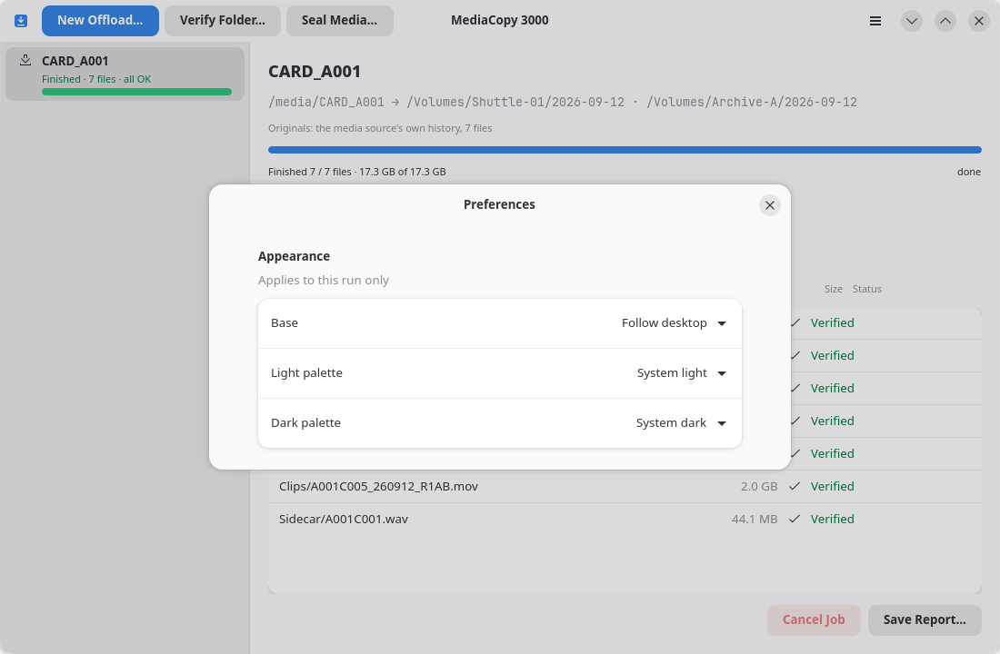

## Thème

Le groupe `Apparence` contient trois paramètres :

| Paramètre | Fonction |
|---|---|
| `Base` | Détermine qui choisit entre le mode clair et le mode sombre. |
| `Palette claire` | La palette utilisée par la fenêtre lorsque la base est claire. |
| `Palette sombre` | La palette utilisée par la fenêtre lorsque la base est sombre. |

Le paramètre `Base` propose trois valeurs :

| Valeur | Fonction |
|---|---|
| `Suivre le bureau` | Le bureau décide. Un changement au niveau du bureau est immédiatement répercuté sur la fenêtre, sans être retardé par une tâche en cours. |
| `Toujours clair` | La fenêtre reste en mode clair, quel que soit l'état du bureau. |
| `Toujours sombre` | La fenêtre reste en mode sombre, quel que soit l'état du bureau. |

Lorsque la base est fixée sur un mode spécifique, l'une des deux lignes de
palette devient inactive. Cette ligne est grisée et ne peut être modifiée tant
que la base ne permet pas à nouveau son utilisation.

Chaque liste de palettes contient uniquement les palettes correspondant à sa
propre base. Une ligne indique uniquement le nom de la palette, car la ligne
située au-dessus précise déjà la base. La liste comporte une section par
famille, et l'en-tête de section indique le nom de la famille.

| Liste | Sections et lignes |
|---|---|
| Palette claire | `System` → `System light` ; `Catppuccin` → `Latte` ; `Dracula` → `Alucard` ; `Everforest` → `Hard`, `Medium`, `Soft` ; `Kanagawa` → `Lotus` |
| Palette sombre | `System` → `System dark` ; `Catppuccin` → `Frappé`, `Macchiato`, `Mocha` ; `Dracula` → `Dracula` ; `Everforest` → `Hard`, `Medium`, `Soft` ; `Kanagawa` → `Dragon`, `Wave` |

Une famille n'apparaît dans une liste que si elle contient une feuille de style correspondant à cette base.

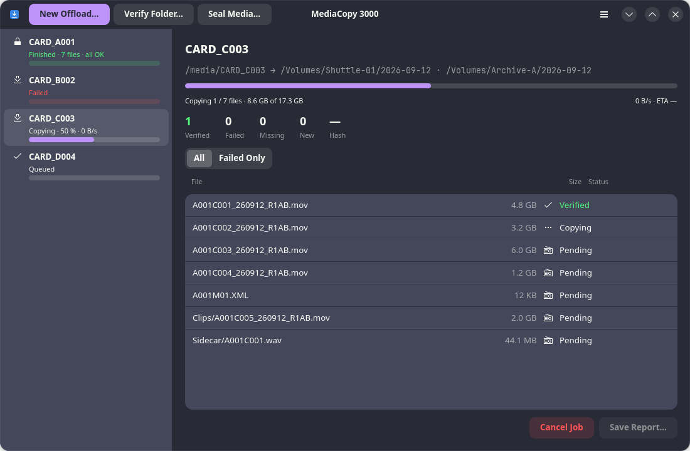

## Origine de la liste

L'application lit la liste à chaque démarrage. Elle ne contient pas de nom de palette en propre.

```
assets/themes/<famille>/<light|dark>/<nom>.css
```

Le premier répertoire indique la famille, le second indique la variante de
base (clair ou sombre), et le nom du fichier fournit le reste de l'intitulé. Un
tiret dans le nom de fichier est remplacé par une espace, et chaque mot commence
par une majuscule. Un répertoire portant un nom autre que `light` ou `dark` ne
contient pas de palette ; l'application l'ignore.

Pour ajouter une palette, placez un fichier CSS à cet emplacement. Pour en supprimer une, effacez son fichier.

## Informations sur la famille

Une famille peut contenir un fichier JSON aux côtés de ses répertoires `light` et `dark` :

```
assets/themes/<famille>/family.json
```

```json
{
"name": "Catppuccin",
"homepage": "https://catppuccin.com"
}
```

| Champ | Fonction |
|---|---|
| `name` | Le nom affiché dans l'en-tête de la section. S'il est absent, l'en-tête reprend le nom du répertoire. |
| `homepage` | L'adresse de la page dédiée à la famille. Si elle est présente, un bouton de lien apparaît à droite de l'en-tête ; cliquer dessus ouvre la page dans le navigateur. |

Ces deux champs sont facultatifs, tout comme le fichier lui-même. Si le fichier
ne peut être analysé, seules les métadonnées sont perdues ; les palettes restent
dans la liste et l'application indique la raison de l'échec de l'analyse dans sa
sortie d'erreur. L'en-tête « System » ne comporte pas de lien.

| Famille | Page |
|---|---|
| `Catppuccin` | <https://catppuccin.com> |
| `Dracula` | <https://draculatheme.com> |
| `Everforest` | <https://everforest.vercel.app> |
| `Kanagawa` | <https://github.com/rebelot/kanagawa.nvim> |

## Galerie

Une photo de la file d'attente pour chaque palette, dans l'ordre indiqué par les listes. Cliquez sur une image pour l'ouvrir dans un nouvel onglet.


### [Catppuccin](https://catppuccin.com)

#### Thèmes clairs

<div class="theme-gallery">
  <figure>
    <a :href="catLatte" target="_blank" rel="noopener">
      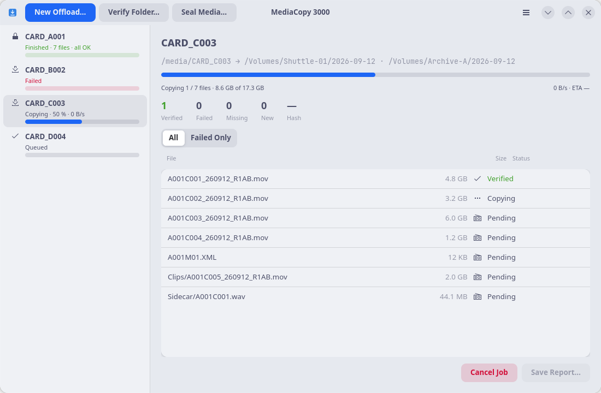
    </a>
    <figcaption>Latte</figcaption>
  </figure>
</div>

#### Thèmes sombres

<div class="theme-gallery">
  <figure>
    <a :href="catFrappe" target="_blank" rel="noopener">
      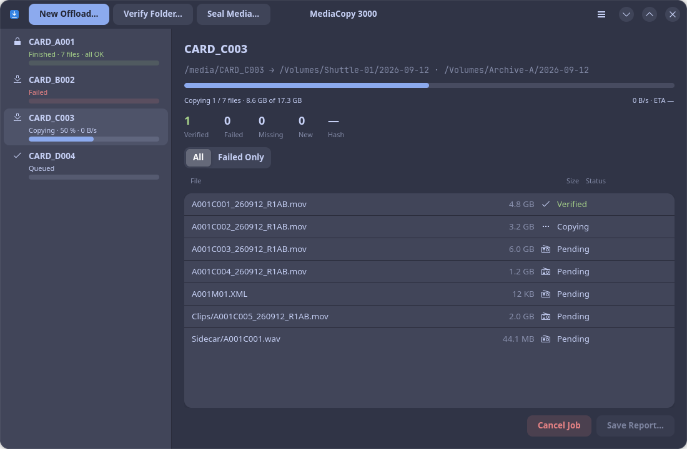
    </a>
    <figcaption>Frappé</figcaption>
  </figure>
  <figure>
    <a :href="catMacchiato" target="_blank" rel="noopener">
      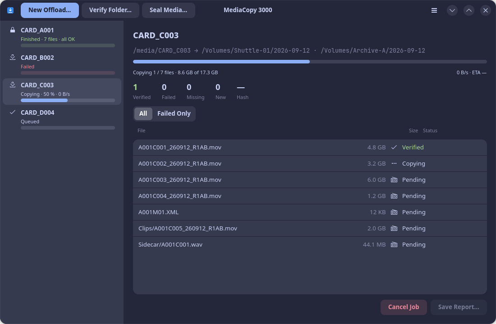
    </a>
    <figcaption>Macchiato</figcaption>
  </figure>
  <figure>
    <a :href="catMocha" target="_blank" rel="noopener">
      
    </a>
    <figcaption>Mocha</figcaption>
  </figure>
</div>

### [Dracula](https://draculatheme.com)

#### Thème clair

<div class="theme-gallery">
  <figure>
    <a :href="alucard" target="_blank" rel="noopener">
      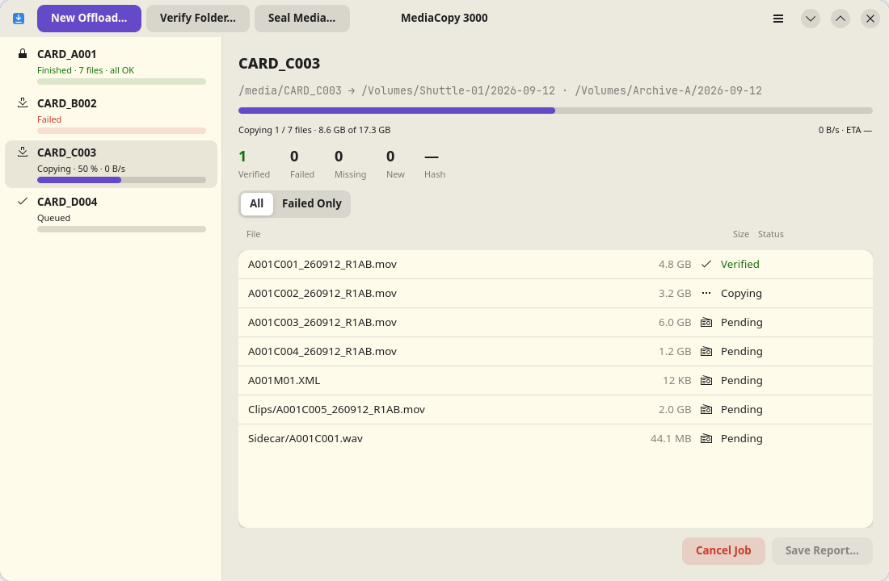
    </a>
    <figcaption>Alucard</figcaption>
  </figure>
</div>

#### Thème sombre

<div class="theme-gallery">
  <figure>
    <a :href="dracula" target="_blank" rel="noopener">
      
    </a>
    <figcaption>Dracula</figcaption>
  </figure>
</div>

### [Everforest](https://everforest.vercel.app)

#### Thèmes clairs

<div class="theme-gallery">
  <figure>
    <a :href="evLightHard" target="_blank" rel="noopener">
      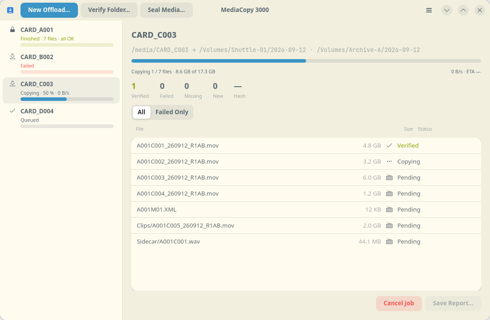
    </a>
    <figcaption>Hard</figcaption>
  </figure>
  <figure>
    <a :href="evLightMedium" target="_blank" rel="noopener">
      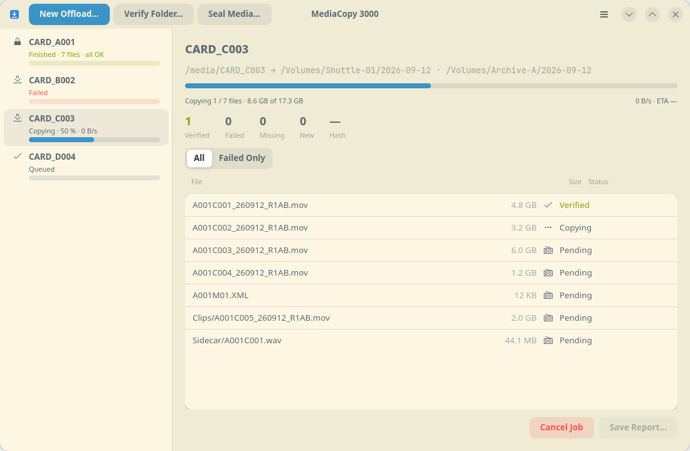
    </a>
    <figcaption>Medium</figcaption>
  </figure>
  <figure>
    <a :href="evLightSoft" target="_blank" rel="noopener">
      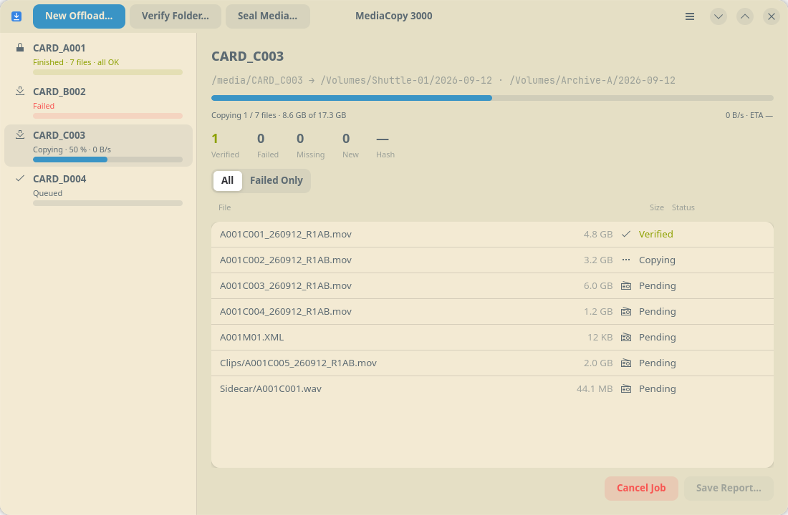
    </a>
    <figcaption>Soft</figcaption>
  </figure>
</div>

#### Thèmes sombres

<div class="theme-gallery">
  <figure>
    <a :href="evDarkHard" target="_blank" rel="noopener">
      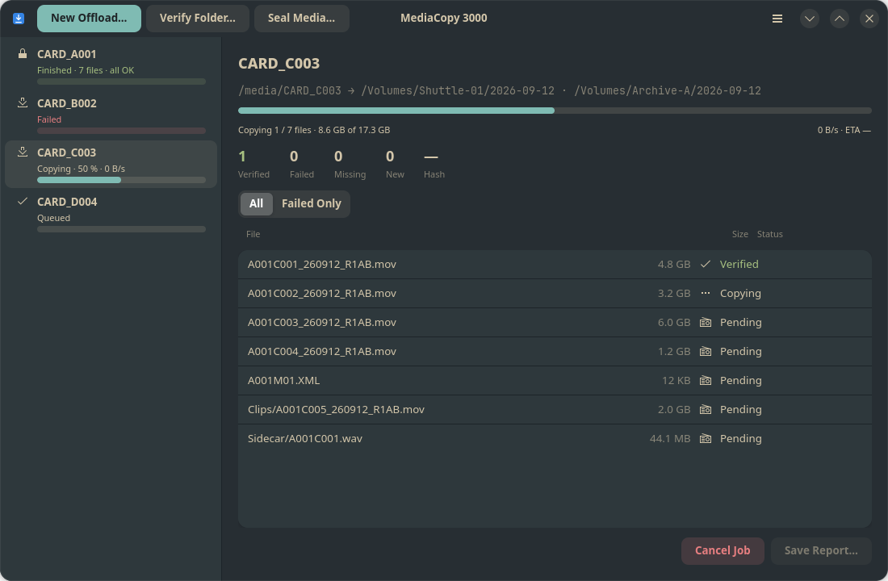
    </a>
    <figcaption>Hard</figcaption>
  </figure>
  <figure>
    <a :href="evDarkMedium" target="_blank" rel="noopener">
      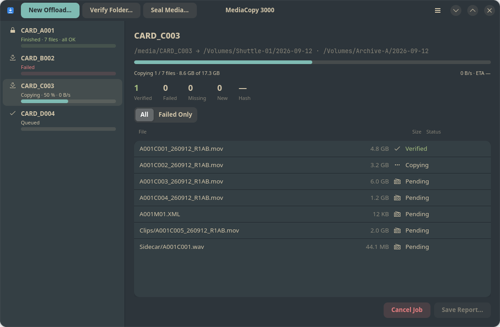
    </a>
    <figcaption>Medium</figcaption>
  </figure>
  <figure>
    <a :href="evDarkSoft" target="_blank" rel="noopener">
      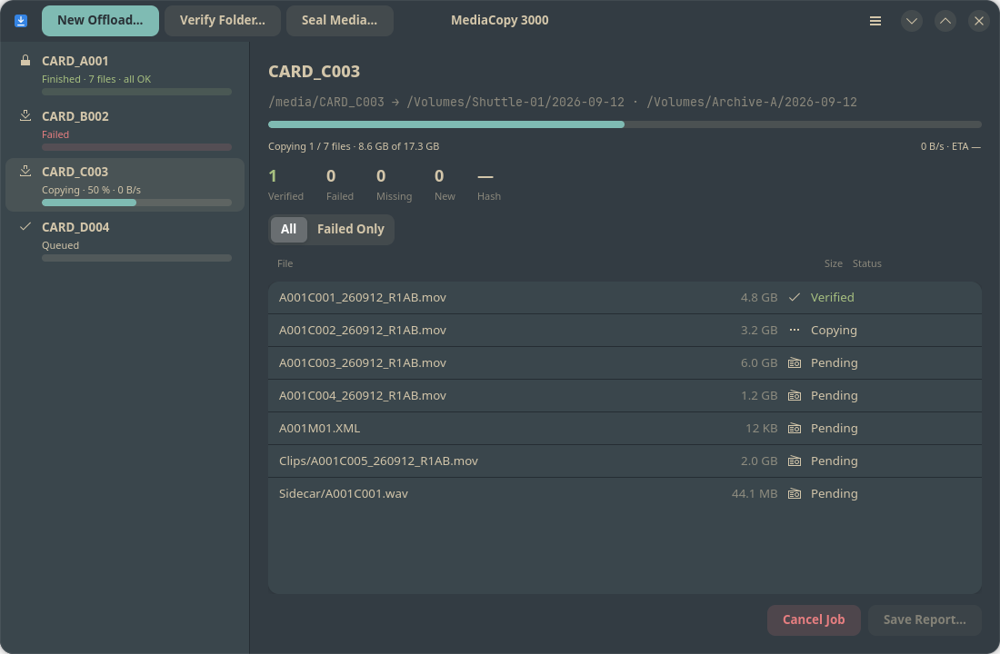
    </a>
    <figcaption>Soft</figcaption>
  </figure>
</div>

### [Kanagawa](https://github.com/rebelot/kanagawa.nvim)

#### Thème clair

<div class="theme-gallery">
  <figure>
    <a :href="kanaLotus" target="_blank" rel="noopener">
      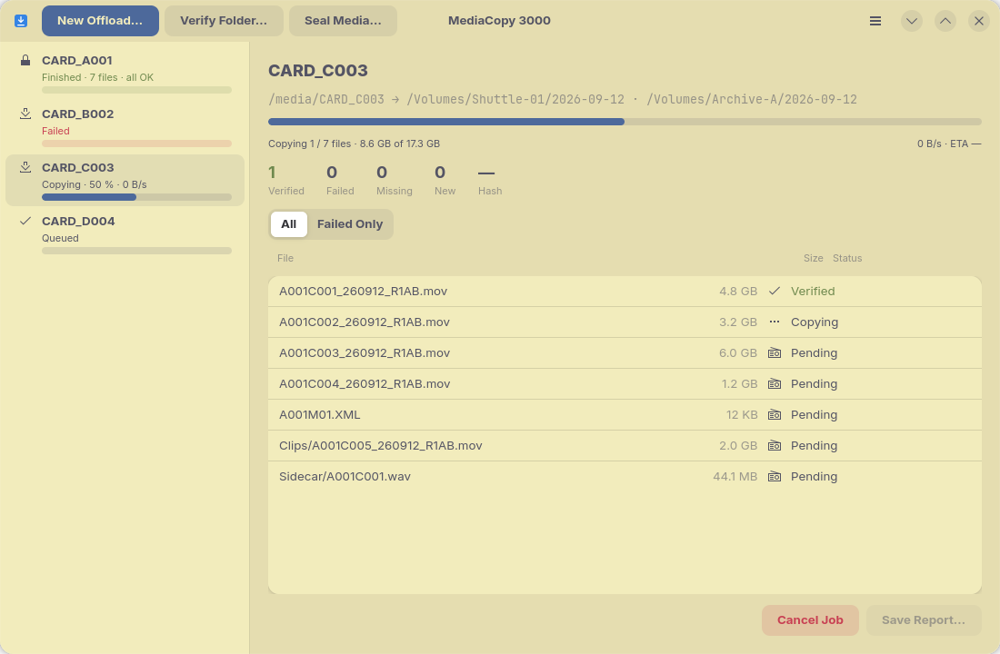
    </a>
    <figcaption>Lotus</figcaption>
  </figure>
</div>

#### Thèmes sombres

<div class="theme-gallery">
  <figure>
    <a :href="kanaDragon" target="_blank" rel="noopener">
      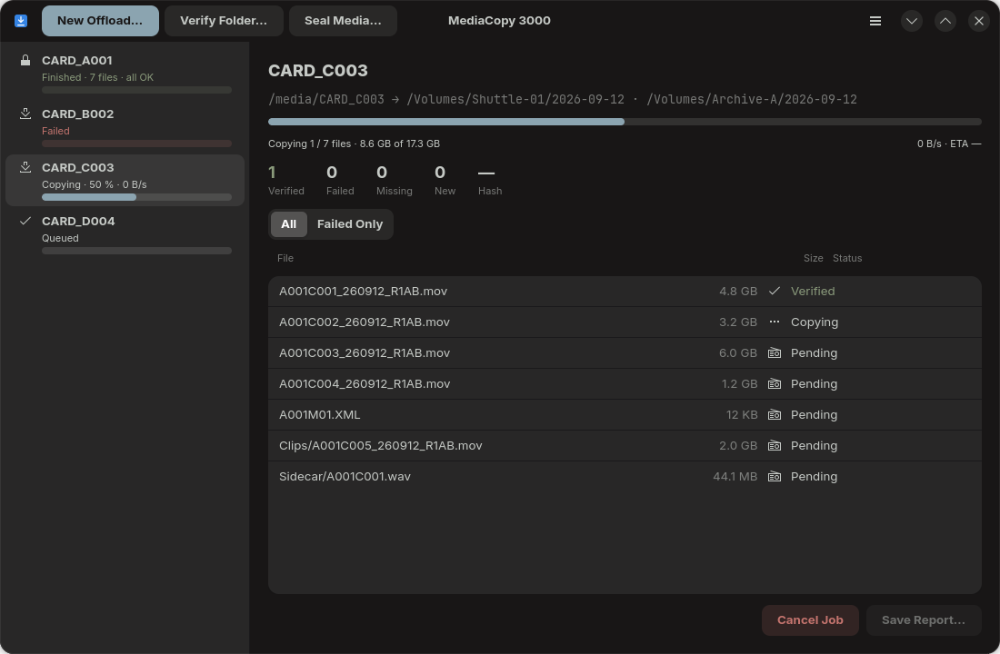
    </a>
    <figcaption>Dragon</figcaption>
  </figure>
  <figure>
    <a :href="kanaWave" target="_blank" rel="noopener">
      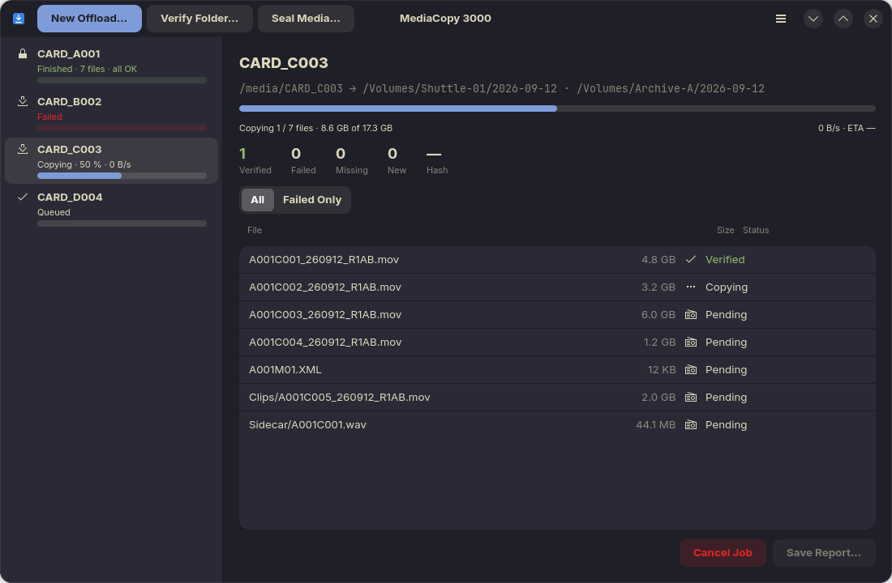
    </a>
    <figcaption>Wave</figcaption>
  </figure>
</div>

<style scoped>
.theme-gallery {
  display: grid;
  grid-template-columns: repeat(3, minmax(0, 1fr));
  gap: 1rem;
  margin: 1rem 0 2rem;
}
.theme-gallery figure {
  margin: 0;
  border: 1px solid var(--vp-c-divider);
  border-radius: 8px;
  overflow: hidden;
  background: var(--vp-c-bg-soft);
}
.theme-gallery img {
  display: block;
  width: 100%;
  height: auto;
}
.theme-gallery figcaption {
  padding: 0.5rem 0.75rem;
  font-size: 0.9rem;
  text-align: center;
}
@media (max-width: 720px) {
  .theme-gallery { grid-template-columns: 1fr; }
}
</style>
