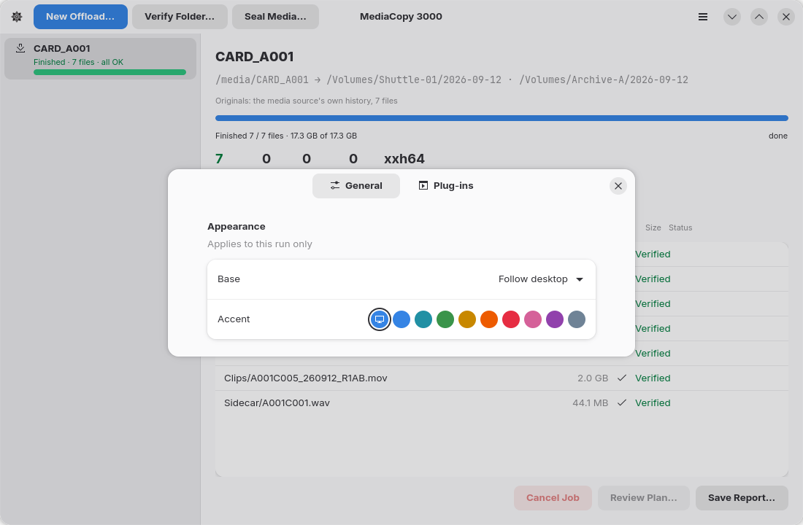
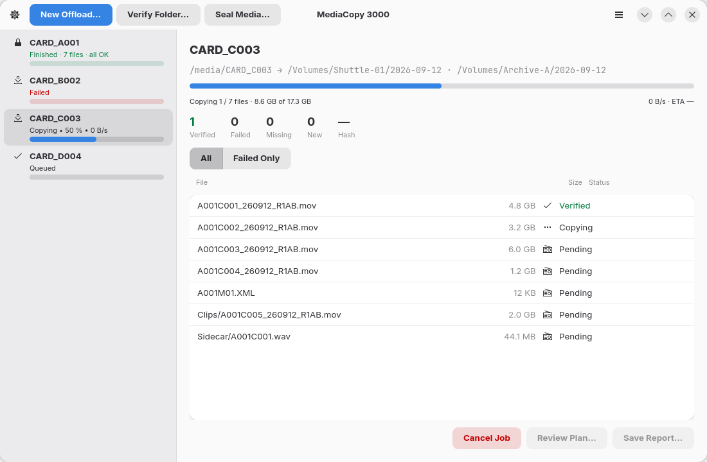
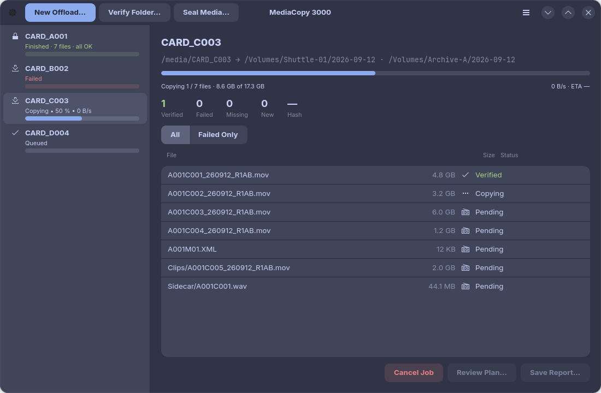

# Apparence

Ouvrez les préférences via l'élément de menu **Préférences** ou avec `Ctrl+,`.

## Thème

Le groupe `Appearance` contient deux réglages :

| Réglage | Effet |
|---|---|
| `Base` | Indique qui choisit entre clair et sombre. |
| `Accent` | Définit la couleur des boutons, des liens et des sélections. |

`Base` a trois valeurs :

| Valeur | Effet |
|---|---|
| `Suivre le bureau` | Le bureau décide. Un changement du bureau s'applique tout de suite, même pendant une tâche. |
| `Toujours clair` | La fenêtre reste claire, quel que soit le bureau. |
| `Toujours sombre` | La fenêtre reste sombre, quel que soit le bureau. |

Le thème clair est le thème standard de GNOME. Le thème sombre est
[Catppuccin Frappé](https://catppuccin.com).

## Accent

Le premier bouton suit l'accent du bureau. Les autres boutons choisissent une de
ces couleurs.

| Couleur | Thème clair | Thème sombre |
|---|:---:|:---:|
| Bleu |  |  |
| Sarcelle |  |  |
| Vert |  |  |
| Jaune |  |  |
| Orange |  |  |
| Rouge |  |  |
| Rose |  |  |
| Violet |  |  |
| Ardoise |  |  |

