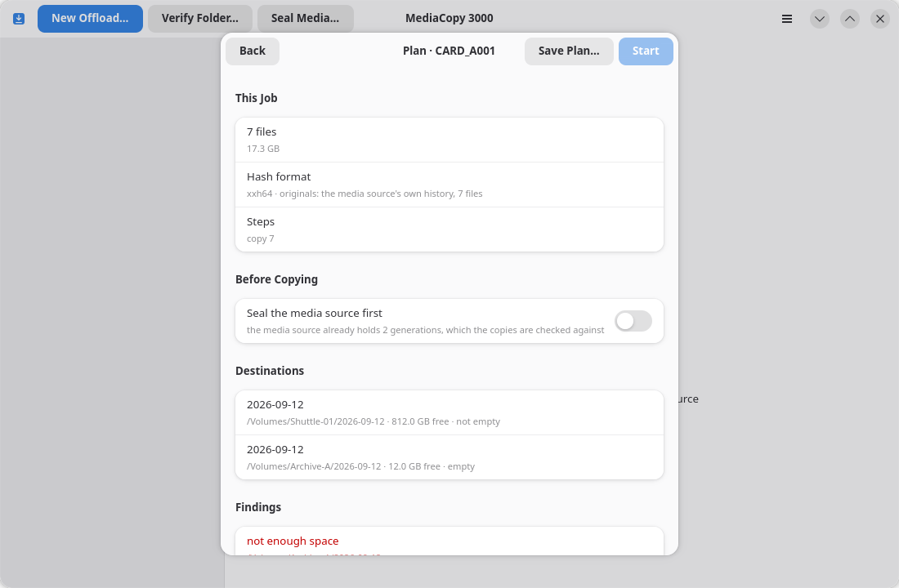

# Constats

Un constat est une information relevée par le plan dont vous devez prendre connaissance. Chaque constat constitue soit un blocage, soit un avertissement.

- Un **blocage** empêche le lancement de la tâche. Le bouton **Démarrer** reste grisé.
- Un **avertissement** n'empêche aucune action.



Chaque constat est associé à un code. Ce code est identique dans l'interface, dans le rapport et dans les tests ; il ne peut donc y avoir de divergence entre ces trois éléments quant à la nature du constat.

## Pourquoi un blocage n'est pas une question

Un blocage n'est pas une question. La fiche ne comporte aucun bouton permettant de le valider. La tâche ne peut démarrer tant que la cause du blocage n'a pas été éliminée.

Le blocage « la destination contient des fichiers absents de la source » en illustre la raison. Lors d'un transfert, chaque fichier est d'abord écrit sous un nom temporaire avant d'être renommé avec son nom définitif. Si l'écriture d'un nouveau fichier échoue, la tâche supprime les deux noms. Si l'écriture échoue alors qu'un fichier existe déjà, la tâche supprime le nom temporaire et conserve l'ancien fichier. La tâche ne peut garantir ce comportement que pour les fichiers qu'elle connaît, c'est-à-dire ceux de la source. Un fichier inconnu risquant d'être perdu, la fiche refuse le dossier sélectionné.

## Blocages

| Message affiché | Signification | Action requise |
|---|---|---|
| `source not found` | La source est introuvable au chemin indiqué. | Montez le volume ou sélectionnez à nouveau le chemin. |
| `destination holds a partial copy` | La destination contient déjà certains fichiers provenant de cette source. | Choisissez **Reprendre** ou **Remplacer** dans la section **Avant la copie**. La page [Transfert d'une source](offload.md) explique ces deux options. |
| `destination holds files that are not on the media source` | La destination contient un fichier, un dossier ou une génération absents de la source. | Sélectionnez un dossier vide ou un dossier qui n'existe pas encore. Les détails indiquent le premier élément (fichier, dossier ou génération) concerné, par ordre trié. |
| `destination was copied from another media source` | La destination contient un historique dont la génération ne correspond pas à celle, portant le même nom, de la source multimédia. | Choisissez une autre destination ou vérifiez ce dossier à l'aide de la fonction **Vérifier le dossier…**. |
| `destination cannot be read` | Le dossier n'a pas pu être lu du tout. | Vérifiez que le volume est monté et que vous disposez des droits d'écriture dessus. |
| `destination history cannot be read` | La destination contient un dossier `ascmhl`, mais sa chaîne ou un manifeste qu'elle référence n'a pas pu être lu. | Lisez la destination avec un autre outil ASC MHL ou choisissez une autre destination. |
| `not enough space` | L'espace libre sur la destination est insuffisant pour la tâche. | Libérez de l'espace ou choisissez un autre volume. |
| `hash format cannot be settled` | Les enregistrements que cette tâche doit vérifier contiennent plusieurs formats de hachage. | Vérifiez d'abord le dossier dans un format donné ou effectuez le transfert vers une destination vierge. |
| `chain names no manifest` | Le fichier de chaîne est présent mais ne référence aucune génération. Un sceau précédemment créé a été perdu. | Lisez le dossier avec un autre outil ASC MHL avant d'y écrire quoi que ce soit d'autre. |
| `chain cannot be read` | Le fichier `ascmhl_chain.xml` est corrompu ou ne correspond pas au fichier attendu. | Consultez les détails, qui indiquent le nom du fichier et l'erreur d'analyse. |
| `a manifest the chain names cannot be read` | Un manifeste référencé par la chaîne est absent ou illisible (erreur d'analyse). | Les détails indiquent le nom du fichier ainsi que la mention `missing` (absent) ou l'erreur d'analyse. |
| `folder has no history` | Une tâche de vérification a été lancée sur un dossier dépourvu de dossier `ascmhl`. | Scellez plutôt le dossier. Seule une tâche de vérification déclenche ce message. |

## Avertissements

| Message affiché | Signification | Action recommandée |
|---|---|---|
| `source is empty` | La source multimédia ne contient aucun fichier. | Vérifiez que vous avez sélectionné le bon dossier. La tâche peut s'exécuter mais n'enregistrera rien. |
| `folder is already sealed` | La source multimédia contient déjà une génération, et cette tâche en créerait une autre. | Désactivez l'option **Sceller d'abord la source multimédia** ou utilisez **Vérifier le dossier…**. |

## Constatations du rapport

Chaque constatation figure dans le bloc `Plan` du rapport enregistré, accompagnée de sa gravité et de ses détails :

```
avertissement : le dossier est déjà scellé – génération 2
```

Le rapport conserve les avertissements que vous avez acceptés, de sorte que la décision reste associée à l'enregistrement.
