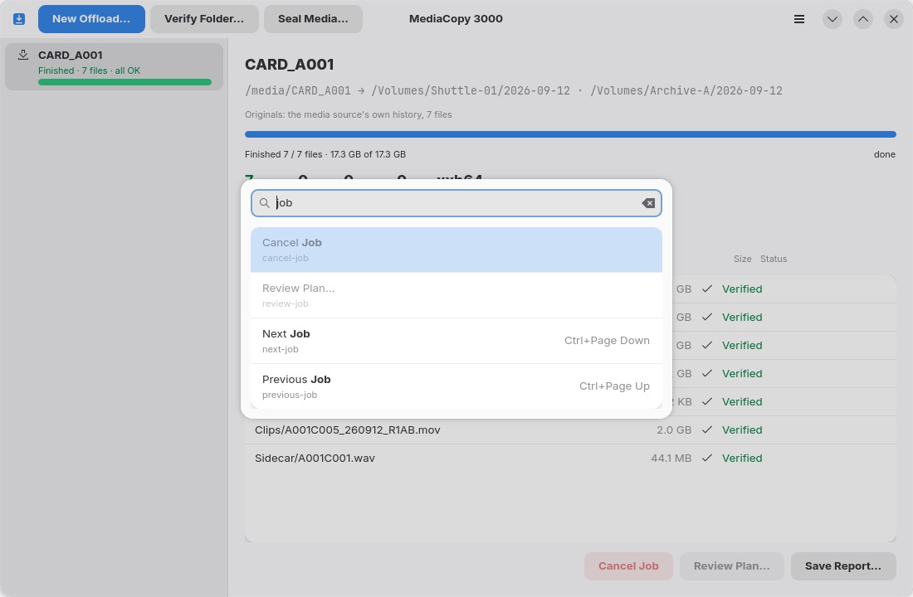

# Raccourcis clavier

L'élément de menu **Raccourcis clavier** affiche cette liste au sein de
l'application. La combinaison <kbd>Ctrl</kbd>+<kbd>?</kbd> permet de l'ouvrir.
Le bouton de la barre d'en-tête, l'élément de menu correspondant et la ligne
associée dans cette fenêtre portent tous la même étiquette.

## Tâches

| Touche | Action |
|---|---|
| <kbd>Ctrl</kbd>+<kbd>N</kbd> | `Nouveau déchargement…` |
| <kbd>Ctrl</kbd>+<kbd>O</kbd> | `Vérifier le dossier…` |
| <kbd>Ctrl</kbd>+<kbd>L</kbd> | `Sceller le support…` |
| <kbd>Ctrl</kbd>+<kbd>S</kbd> | `Enregistrer le rapport…` pour la tâche sélectionnée |

## Navigation

| Touche | Action |
|---|---|
| <kbd>Ctrl</kbd>+<kbd>Page bas</kbd> | `Tâche suivante` |
| <kbd>Ctrl</kbd>+<kbd>Page haut</kbd> | `Tâche précédente` |

Si aucune tâche n'est sélectionnée, la touche « suivante » sélectionne la première tâche de la liste et la touche « précédente » sélectionne la dernière. Dans les deux cas, la navigation s'arrête aux extrémités de la liste.

## Général

| Touche | Action |
|---|---|
| <kbd>Ctrl</kbd>+<kbd>,</kbd> | `Préférences` |
| <kbd>Ctrl</kbd>+<kbd>K</kbd> | `Palette de commandes…` |
| <kbd>Ctrl</kbd>+<kbd>?</kbd> | `Raccourcis clavier` |
| <kbd>Ctrl</kbd>+<kbd>W</kbd> | `Fermer la fenêtre` |
| <kbd>Ctrl</kbd>+<kbd>Q</kbd> | `Quitter` |
| <kbd>F10</kbd> | `Menu principal` |

Les commandes <kbd>Ctrl</kbd>+<kbd>W</kbd> et <kbd>Ctrl</kbd>+<kbd>Q</kbd> demandent une confirmation préalable si une tâche est en cours d'exécution.

## La palette de commandes

<kbd>Ctrl</kbd>+<kbd>K</kbd> ouvre la liste de toutes les commandes. Tapez pour la filtrer. La
palette lit l'étiquette et l'identifiant court sous elle, sans tenir compte de la casse ni des
accents. Quand la correspondance porte sur l'étiquette, les lettres saisies s'affichent en gras. <kbd>Haut</kbd> et <kbd>Bas</kbd> déplacent la
sélection, <kbd>Entrée</kbd> exécute la commande et <kbd>Échap</kbd> ferme la palette. Une ligne
grisée est une commande qui ne peut pas s'exécuter pour le moment.

## Dans une boîte de dialogue

| Touche | Action |
|---|---|
| <kbd>Entrée</kbd> | Appuyez sur le bouton suggéré : `Examiner le plan…` dans la boîte de dialogue de déchargement, ou `Démarrer` sur la fiche du plan |
| <kbd>Échap</kbd> | Ferme la boîte de dialogue. Sur la fiche du plan, cela annule le plan. |

La touche `Entrée` est sans effet tant que le bouton suggéré est grisé.

## Touches d'accès rapide

Dans une boîte de dialogue, une lettre est soulignée sur chaque bouton. Appuyer sur `Alt` et cette lettre active le bouton correspondant.

| Boîte de dialogue | Bouton | Touche |
|---|---|---|
| Nouveau déchargement | `Annuler` | <kbd>Alt</kbd>+<kbd>C</kbd> |
| Nouveau déchargement | `Examiner le plan…` | <kbd>Alt</kbd>+<kbd>R</kbd> |
| Nouveau déchargement | `Choisir…` | <kbd>Alt</kbd>+<kbd>O</kbd> |
| Nouveau déchargement | `Ajouter une destination…` | <kbd>Alt</kbd>+<kbd>A</kbd> |
| Plan | `Retour` | <kbd>Alt</kbd>+<kbd>B</kbd> |
| Plan | `Démarrer` | <kbd>Alt</kbd>+<kbd>S</kbd> |
| Arrêter la tâche en cours ? | `Poursuivre` | <kbd>Alt</kbd>+<kbd>K</kbd> |
| Arrêter la tâche en cours ? | `Arrêter et fermer` | <kbd>Alt</kbd>+<kbd>S</kbd> |

## Sans touche d'accès rapide

**Annuler la tâche** et **Effacer les tâches terminées** ne disposent pas de raccourci clavier. Utilisez le bouton dans le volet de détails, l'élément de menu correspondant ou la palette de commandes.
