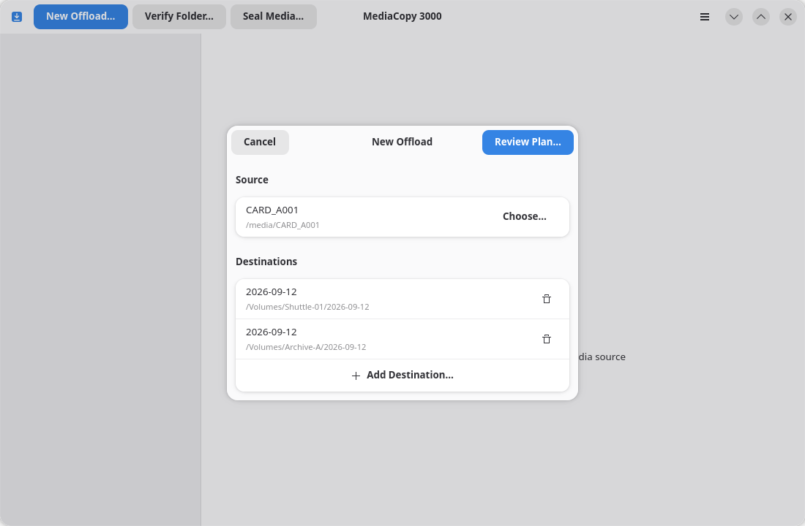
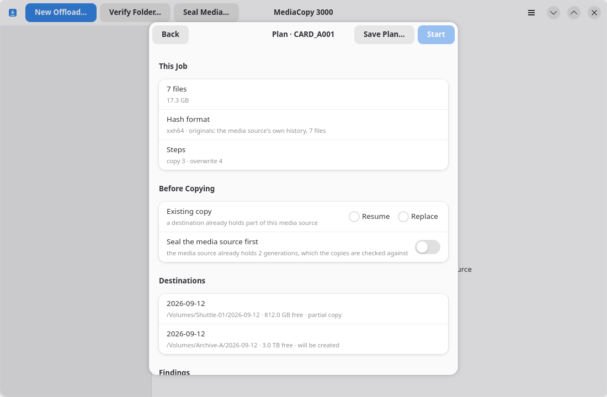

# Effectuer un transfert depuis une source multimédia

Un transfert consiste à copier une source multimédia vers une ou plusieurs
destinations. Chaque fichier est soumis à un calcul de hachage lors de
sa lecture, et chaque copie est relue en contournant le cache du système
d'exploitation, lorsque le volume le permet. Chaque copie est synchronisée
sur le périphérique avant la fermeture du descripteur d'écriture. Un fichier
manifeste est généré dans chaque destination.

Il est possible de sceller la source multimédia avant de lancer la copie. La page
[Sceller d'abord la source multimédia](seal-first.md) explique cette option.

## Lancer le transfert

1. Cliquez sur **New Offload…** ou appuyez sur <kbd>Ctrl</kbd>+<kbd>N</kbd>.
2. Cliquez sur **Choose…** et sélectionnez la source multimédia.
3. Cliquez sur **Add Destination…** et sélectionnez un dossier. Répétez l'opération pour une seconde destination.
4. Cliquez sur **Review Plan…**.



Le bouton **Examiner le plan…** reste grisé tant que la boîte de dialogue ne contient pas une source multimédia et au moins une
destination. Il est impossible d'ajouter deux fois le même dossier.

Pour supprimer une destination, cliquez sur **Supprimer la destination** sur la ligne correspondante.

**Examiner le plan…** ne lance aucune copie. Cette action lit la source multimédia ainsi que les destinations et
affiche un plan. La page [Le plan](the-plan.md) explique les informations contenues dans ce plan. La copie débute
lorsque vous cliquez sur **Démarrer** dans cet écran.

## Ce qu'écrit le transfert

Chaque destination reçoit un dossier portant le même nom que la source multimédia. À l'intérieur de ce dossier, les fichiers sont disposés à leur emplacement d'origine — y compris les dossiers vides — aux côtés d'un dossier `ascmhl` :

```
<destination>/CARD_A001/…les fichiers…
<destination>/CARD_A001/ascmhl/ascmhl_chain.xml
<destination>/CARD_A001/ascmhl/0001_CARD_A001_2026-09-12_120000.mhl
<destination>/CARD_A001/ascmhl/0002_CARD_A001_2026-09-12_140300.mhl
```

Le dossier `ascmhl` correspond à l'historique propre de la source multimédia, copié fichier par fichier, auquel s'ajoute une nouvelle génération pour ce transfert. Dans cet exemple, `0001` représente le sceau déjà présent sur la carte, tandis que `0002` correspond au transfert en cours. Une source multimédia sans historique génère une destination dont la première génération est le transfert lui-même. Chaque destination reçoit sa propre copie, car chaque destination constitue une arborescence distincte. La page [Le format ASC MHL](mhl-format.md) détaille ce point.

Un transfert n'écrit aucune donnée sur la source multimédia, sauf si l'option **Sceller la source multimédia en premier** est activée. L'opération de scellement écrit une génération dans le dossier `ascmhl` de la source multimédia.

## Éléments de comparaison pour la vérification de la copie

Lors d'un transfert, chaque fichier est marqué comme `verified` (vérifié) lorsqu'il est possible de comparer la copie à une empreinte (hash) existante, et comme `original` dans le cas contraire. Les empreintes utilisées pour la comparaison sont les **originales**. Elles proviennent de l'une des trois sources suivantes :

- L'historique propre de la source multimédia, lorsqu'elle en possède un.
- Le sceau généré au début de l'opération, si l'option **Sceller la source multimédia en premier** est activée.
- Aucune source, lorsque la source multimédia ne contient pas d'historique ; dans ce cas, chaque fichier est enregistré comme `original`. Le plan indique laquelle des trois méthodes a été utilisée, et le volet de détails le rappelle sur la ligne `Originals :`.
La page [Sceller d'abord la source multimédia](seal-first.md) explique ce choix.

## Reprendre un transfert annulé

Vous pouvez effectuer un transfert vers une destination contenant déjà une partie de la même source multimédia. La fiche du plan affiche alors le blocage `destination holds a partial copy` (la destination contient une copie partielle) et marque la destination comme `partial copy` (copie partielle). Elle ajoute également une ligne **Existing copy** (Copie existante) sous la section **Before Copying** (Avant la copie). Choisissez l'une des options suivantes :

- **Resume** (Reprendre) conserve les fichiers ayant la taille et l'empreinte (hash) correctes. La tâche calcule l'empreinte de chacun de ces fichiers et ne les copie à nouveau que si l'empreinte diffère. Un tel fichier portera la mention `Replaced after mismatch` (Remplacé après discordance).
- **Replace** (Remplacer) copie à nouveau tous les fichiers, en écrasant ceux qui sont déjà présents.

Ces deux choix aboutissent au même résultat qu'un transfert initial complet : l'arborescence complète, l'historique de la source multimédia et une nouvelle génération.



La destination ne doit contenir que les fichiers de la source multimédia, les
copies incomplètes de ces fichiers se terminant par `.mc3k-part` et l'historique
de la source multimédia elle-même. La présence d'un fichier absent de la source
multimédia constitue un blocage. La page [Constats](findings.md) signale ce type
de fichier.

## Annuler une tâche

Cliquez sur **Cancel** (Annuler) dans le volet de détails pendant l'exécution de la tâche. Les fichiers déjà copiés restent à leur emplacement.

Une tâche annulée ne génère pas de manifeste pour la passe en cours lors de l'arrêt. Une passe de scellement déjà terminée a, quant à elle, déjà inscrit sa génération dans la source multimédia.

Vous pouvez relancer le même transfert vers la même destination. La section ci-dessus explique la procédure.
