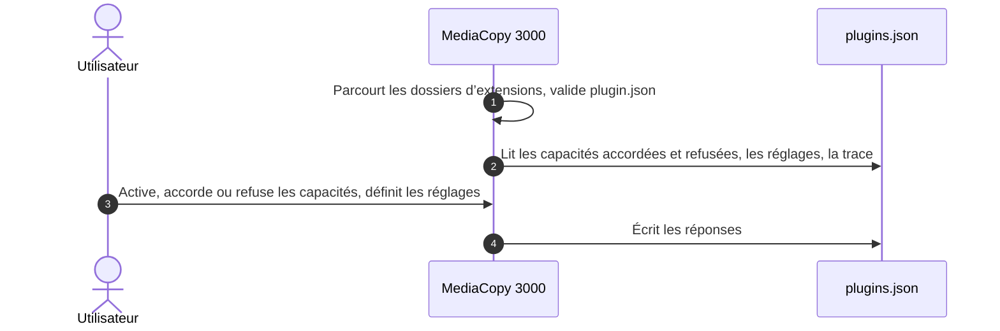
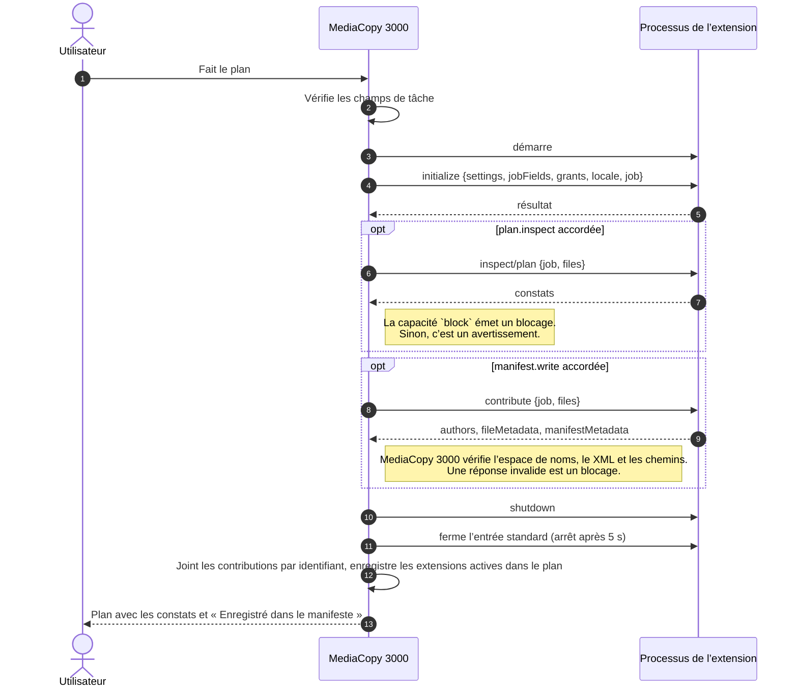
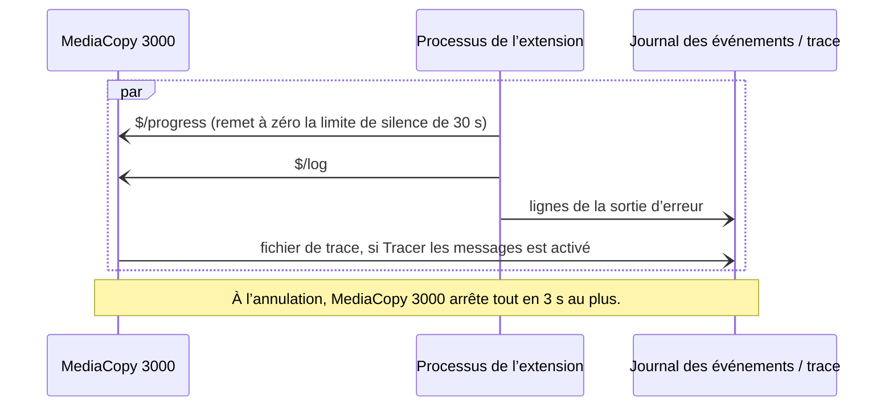

# Extensions

Les extensions ajoutent des fonctions à MediaCopy 3000 sous la forme de programmes séparés.
Vous gérez les extensions dans la page **Extensions** (Plug-ins) des préférences.

Les extensions donnent en général des données supplémentaires à MediaCopy 3000, ou interagissent
avec les fichiers sans les modifier.

## Ce qu’une extension peut faire

Une extension demande des capacités, c’est-à-dire des permissions que MediaCopy 3000 lui donne.
L’utilisateur peut accorder ou refuser l’usage de ces capacités.

| Capacité | Quand elle agit | Ce qu’elle fait |
|---|---|---|
| `files.read` | À tout moment | Lit les fichiers de médias. |
| `plan.inspect` | Quand le plan est fait | Ajoute des constats au plan. |
| `files.inspect` | Après la vérification de chaque fichier | Ajoute au rapport des notes sur chaque fichier vérifié. |
| `block` | Avec `plan.inspect` | Arrête une tâche par un blocage. Sans elle, un blocage de l’extension devient un avertissement. |
| `manifest.write` | Quand le plan est fait | Ajoute des auteurs et des métadonnées à chaque manifeste que la tâche écrit. |

## Installer une extension

Chaque extension a son propre dossier, nommé d’après son identifiant. Le dossier contient un fichier
`plugin.json` et le programme. L’identifiant est un nom de domaine inversé en minuscules, par
exemple `tech.floreal.credits` : il ne contient que `a` à `z`, des chiffres, `.`, `-` et `_`, au
moins un `.` et aucun `..`, et il ne commence ni ne finit par `.`.

| Système | Dossier pour votre compte | Dossier pour tous les comptes |
|---|---|---|
| Linux | `~/.local/share/mediacopy3000/plugins/<identifiant>/` | `mediacopy3000/plugins/<identifiant>/` dans chaque dossier de `XDG_DATA_DIRS`, par exemple `/usr/share` |
| macOS | `~/Library/Application Support/MediaCopy3000/Plugins/<identifiant>/` | Aucun. Le dossier dans l’application contient les extensions fournies avec MediaCopy 3000 : voir le tableau suivant. |
| Windows | `%APPDATA%\MediaCopy3000\plugins\<identifiant>\` | `%PROGRAMDATA%\MediaCopy3000\plugins\<identifiant>\` |
| Flatpak | `~/.var/app/tech.floreal.MediaCopy3000/data/mediacopy3000/plugins/<identifiant>/` | L’extension Flatpak `tech.floreal.MediaCopy3000.Plugin.<identifiant>` |

Les extensions fournies avec MediaCopy 3000 sont dans un autre dossier :

| Système | Dossier des extensions fournies avec MediaCopy 3000 |
|---|---|
| Linux | `lib/mediacopy3000/plugins/<identifiant>/` à côté du dossier `bin` du programme, par exemple `/usr/lib/mediacopy3000/plugins/<identifiant>/` |
| macOS | `MediaCopy3000.app/Contents/PlugIns/<identifiant>/` |
| Windows | `%LOCALAPPDATA%\Programs\MediaCopy 3000\plugins\<identifiant>\` |
| Flatpak | `/app/lib/mediacopy3000/plugins/<identifiant>/` |

Si deux dossiers ont le même identifiant, le dossier de votre compte l’emporte, et le dossier des
extensions fournies avec MediaCopy 3000 perd. Vous pouvez donc installer pour votre compte une
version plus récente d’une telle extension.

## Activer une extension


Une extension que vous installez est désactivée. Elle demande des capacités, et vous devez répondre
à chacune.

1. Ouvrez le menu principal et choisissez **Extensions** (Plug-ins).
2. Activez l’interrupteur dans la ligne de l’extension.
3. Cliquez sur la ligne de l’extension. Sa page s’ouvre.
4. Dans **Permissions**, pour chaque capacité, choisissez **Accordée** (Granted) ou **Refusée**
   (Declined). MediaCopy 3000 n’envoie pas les requêtes d’une capacité refusée.
5. Dans **Settings** (réglages), pour chaque réglage, tapez une valeur, puis cliquez sur le bouton
   d’application à droite de la ligne.

Pour effacer un réglage, appliquez une valeur vide, ou choisissez **Non défini** (Not set).
L’extension reçoit alors la valeur par défaut du réglage, s’il en a une. Les lignes montrent les
valeurs par défaut.

Une extension ne démarre que si chaque capacité qu’elle demande est accordée ou refusée. Une
nouvelle version qui demande une nouvelle capacité s’arrête jusqu’à votre réponse. Le sous-titre de
la ligne dit pourquoi une extension activée ne démarre pas.

Si vous ajoutez ou retirez un dossier d’extension pendant que les préférences sont ouvertes,
cliquez sur **Chercher à nouveau** (Look Again).

### Le fichier `plugins.json`

MediaCopy 3000 garde vos réponses et les réglages dans le fichier `plugins.json`. Vous pouvez aussi
modifier ce fichier vous-même, par exemple pour installer les mêmes extensions sur plusieurs
ordinateurs.

1. Ouvrez le fichier `plugins.json`. Créez-le s’il n’existe pas.

   | Système | Chemin |
   |---|---|
   | Linux | `~/.config/mediacopy3000/plugins.json` |
   | macOS | `~/Library/Application Support/MediaCopy3000/plugins.json` |
   | Windows | `%APPDATA%\MediaCopy3000\plugins.json` |
   | Flatpak | `~/.var/app/tech.floreal.MediaCopy3000/config/mediacopy3000/plugins.json` |

2. Ajoutez une entrée pour l’extension :

   ```json
   {
     "plugins": {
       "tech.floreal.credits": {
         "enabled": true,
         "grants": ["manifest.write"],
         "declined": [],
         "settings": {
           "authors": [
             {"role": "DIT", "name": "Jane Doe", "email": "jane@example.com", "phone": ""}
           ]
         }
       }
     }
   }
   ```

3. Mettez chaque capacité que l’extension demande dans `grants` ou dans `declined`.
4. Mettez une valeur pour chaque réglage de l’extension dans `settings`.
5. Si les préférences sont ouvertes, cliquez sur **Chercher à nouveau** (Look Again).

Quand MediaCopy 3000 écrit `plugins.json`, il garde les clés qu’il ne connaît pas.

## L’extension Credits

MediaCopy 3000 est fourni avec l’extension Credits, `tech.floreal.credits`. Elle met les
noms de l’équipe dans chaque manifeste qu’une tâche écrit. Comme toute extension, elle est
désactivée tant que vous ne l’activez pas et n’accordez pas `manifest.write`.

Credits a un seul réglage, **Authors** (auteurs). C’est une liste d’emplacements d’auteur. Chaque
emplacement a un rôle, et un nom, un e-mail et un téléphone par défaut. Le rôle est obligatoire.
Les autres valeurs sont facultatives. Les libellés sont en anglais.

Pour ajouter un emplacement :

1. Ouvrez la page de **Credits**. Dans **Settings**, dans la ligne **Authors**, cliquez sur **Add**.
   Une ligne **New author** apparaît.
2. Dépliez la ligne. Tapez le rôle, par exemple `DIT`, puis cliquez sur le bouton d’application.
3. Si la même personne occupe cet emplacement sur la plupart des tâches, tapez le nom, l’e-mail et
   le téléphone.

Pour retirer un emplacement, dépliez sa ligne et cliquez sur **Remove**.

Pour chaque tâche, la fiche du plan demande le nom, l’e-mail et le téléphone de chaque emplacement,
dans le groupe **Champs de tâche**. Chaque ligne commence avec la valeur par défaut du réglage. Une
ligne vide garde la valeur par défaut. Un emplacement sans nom n’est pas écrit.

Le manifeste reçoit alors un élément `author` pour chaque emplacement qui a un nom, avec son
`role`, et avec l’`email` et le `phone` quand ils sont donnés. Credits n’écrit pas de `metadata`.

Credits refuse une tâche quand aucun emplacement n’a de nom.

## Ce que MediaCopy 3000 impose

| Capacité | Ce qu’elle permet | Ce que MediaCopy 3000 impose |
|---|---|---|
| `files.read` | Lire les fichiers de médias | Rien. L’extension le promet. |
| `plan.inspect` | Recevoir `inspect/plan` quand le plan est fait | Sans cette capacité, MediaCopy 3000 n’envoie pas la requête. |
| `files.inspect` | Recevoir `inspect/file` après chaque fichier vérifié | Sans cette capacité, MediaCopy 3000 n’envoie pas la requête. |
| `block` | Arrêter une tâche par un blocage | Sans cette capacité, un blocage de l’extension devient un avertissement. |
| `manifest.write` | Recevoir `contribute` et ajouter des données au manifeste | Sans cette capacité, MediaCopy 3000 ne demande pas de données à l’extension. |

Une extension est un programme qui tourne avec vos droits. MediaCopy 3000 ne peut pas l’empêcher de
lire un fichier ou d’ouvrir une connexion réseau. N’installez que des extensions d’une source de
confiance.

## Champs de tâche

Une extension peut demander une valeur pour chaque tâche, par exemple le nom du cadreur.

Dans la fenêtre, la fiche du plan montre le groupe **Champs de tâche** (Job Fields), avec une ligne
pour chaque champ de chaque extension activée. Tapez la valeur, puis cliquez sur le bouton
d’application. MediaCopy 3000 établit le plan à nouveau avec la valeur. La page
[Le plan](the-plan.md) montre ce groupe.

Sur la ligne de commande, donnez la valeur avec `--plugin-field` :

```
mediacopy3000 plan offload SOURCE DEST --plugin-field tech.floreal.credits:authors.0.name="Sam Roe"
```

Si un champ de tâche obligatoire n’a pas de valeur, le plan donne le constat
`le champ authors n’a pas de valeur valide`. Pour une extension avec `manifest.write`, ou avec
`block` et `plan.inspect`, ce constat est un blocage. Pour toute autre extension, c’est un
avertissement, et l’extension ne s’exécute pas.

## Quand une extension échoue

Une extension échoue quand elle ne démarre pas, s’arrête, envoie une réponse invalide, ne lit pas
une requête, écrit une ligne de plus de 16 Mio, ou ne donne aucun signe de vie pendant 30 secondes.
Une tâche longue n’échoue pas tant que l’extension signale son avancement.

| Quand | Extension | Résultat |
|---|---|---|
| Le plan est fait | Une extension avec `manifest.write`, ou avec `block` et `plan.inspect` | Un blocage. **Démarrer** reste grisé. |
| Le plan est fait | Toute autre extension | Un avertissement. L’extension ne prend pas part à la tâche. |
| Le plan est bloqué | Toutes | Aucune extension ne démarre pour la tâche. |
| Un fichier est inspecté | Une extension avec `files.inspect` | MediaCopy 3000 redémarre l’extension et renvoie le même fichier. Après un second échec, les fichiers restants sont `non inspectés`. Le résultat de la tâche ne change pas. |

Quand vous annulez une tâche, MediaCopy 3000 arrête chaque extension, et les programmes qu’elle a
lancés, en 3 secondes au plus.

## Écrire une extension

Une extension lit des messages sur son entrée standard et écrit ses réponses sur sa sortie standard.
Chaque message est un objet [JSON-RPC 2.0](https://www.jsonrpc.org/) sur une ligne. MediaCopy 3000
envoie ces requêtes :

| Méthode | Quand |
|---|---|
| `initialize` | En premier. Elle donne les réglages, les champs de tâche et les capacités accordées. |
| `inspect/plan` | Quand le plan est fait, à une extension avec `plan.inspect` |
| `contribute` | Quand le plan est fait, à une extension avec `manifest.write` |
| `inspect/file` | Après chaque fichier vérifié, à une extension avec `files.inspect` |
| `shutdown` | En dernier |

L’extension peut envoyer les notifications `$/progress` et `$/log`. Les lignes de sa sortie
d’erreur vont dans le journal des événements de la tâche.

Le fichier `plugin-protocol/schema/protocol-1.schema.json` du code source décrit chaque message et
`plugin.json`.

Le fichier `plugin.json` a ces clés :

| Clé | Obligatoire | Sens |
|---|---|---|
| `id` | Oui | L’identifiant de l’extension. Les règles d’un identifiant sont dans « Installer une extension ». |
| `name` | Oui | Le nom que les préférences montrent. |
| `description` | Oui | Une ou deux phrases courtes qui disent ce que fait l’extension. La page de l’extension la montre sous le nom. Elle ne peut pas être vide. |
| `version` | Oui | La version de l’extension, en texte. |
| `api` | Oui | La version majeure de l’API des extensions. Elle doit être `1`. |
| `executable` | Oui | Un chemin pour chaque système : `linux-x86_64`, `linux-aarch64`, `macos-x86_64`, `macos-aarch64` et `windows-x86_64`. Les règles d’un chemin sont dans la liste qui suit. |
| `namespace` | Avec `manifest.write` | Le seul espace de noms XML que l’extension écrit. Voir « Écrire dans le manifeste ». |
| `capabilities` | Oui | Les capacités que l’extension demande : `files.read`, `plan.inspect`, `files.inspect`, `block` ou `manifest.write`. Au moins une parmi `plan.inspect`, `files.inspect` et `manifest.write`. `block` demande `plan.inspect`. `manifest.write` demande `namespace`. |
| `settings` | Non | Les réglages que les préférences montrent. Chaque réglage a une `key`, un `label`, un `kind`, et peut avoir `required` et `default`. Un `choice` a aussi `options`. |
| `jobFields` | Non | Les champs que la fiche du plan demande pour chaque tâche. Ils ont la même forme que les réglages. |

Une extension qui enfreint une de ces règles n’est pas valide. Le groupe **Non valides** (Not Valid)
montre la raison.

Un réglage a un type : `text`, `secret`, `bool`, `choice`, `path` ou `authors`. Le type `authors`
est une liste d’emplacements d’auteur que l’utilisateur modifie dans les préférences. MediaCopy 3000
ne l’accepte que dans `settings`, une seule fois, seulement avec `manifest.write`, et sans
`default`. La fiche du plan demande le nom, l’e-mail et le téléphone de chaque emplacement.
`initialize` donne la liste fusionnée dans `settings`, sans les emplacements qui n’ont pas de nom.
L’extension renvoie ces emplacements comme `authors` dans `contribute`.

Le dossier `plugins/credits` du code source contient l’extension Credits. C’est une extension
complète en Haskell, construite avec la bibliothèque `plugin-protocol`, sous licence BSD 3-Clause.
Copiez-la pour commencer une nouvelle extension.

Une extension doit respecter ces règles :

- Elle s’arrête quand son entrée standard se ferme.
- Elle lit chaque requête. MediaCopy 3000 arrête une extension qui ne lit pas une requête dans le
  délai de l’appel.
- Elle écrit des lignes de 16 Mio au plus.
- Elle donne la même réponse à `inspect/plan` et `contribute` pour la même tâche. MediaCopy 3000
  refait le plan d’une tâche en attente quand vient son tour, et une réponse différente renvoie la
  tâche en révision.
- Elle n’écrit des métadonnées que dans l’espace de noms XML que déclare son `plugin.json`. Cet
  espace de noms ne peut pas être vide, un espace de noms d’ASC MHL, ou un espace de noms que XML
  réserve. Les métadonnées ont au plus 32 niveaux d’éléments, et seulement des caractères que
  XML 1.0 autorise. MediaCopy 3000 retire les commentaires XML et les instructions de traitement.
- Elle n’écrit dans un auteur que des caractères que XML 1.0 autorise.
- Chaque chemin de `executable` est relatif au dossier de l’extension. Il ne commence ni par `/` ni
  par `\`, ne contient pas de `:` et n’a pas de partie `..`. Un seul mauvais chemin, pour n’importe
  quel système, rend l’extension non valide sur tous les systèmes.

MediaCopy 3000 démarre l’extension avec un environnement réduit. Il ne transmet que ces variables
de votre session. Les autres variables, comme les secrets et les jetons, n’atteignent pas
l’extension.

| Système | Variables |
|---|---|
| Linux, macOS, Flatpak | `PATH`, `HOME`, `TMPDIR`, `LANG`, `LC_*`, `TZ`, `USER`, `LOGNAME` |
| Windows | `SystemRoot`, `windir`, `SystemDrive`, `Path`, `PATHEXT`, `ComSpec`, `TEMP`, `TMP`, `USERPROFILE`, `HOMEDRIVE`, `HOMEPATH`, `APPDATA`, `LOCALAPPDATA`, `ProgramData`, `USERNAME` |

MediaCopy 3000 remplace par une espace chaque caractère de contrôle et chaque saut de ligne d’un
texte qui vient d’une extension, comme un titre, un libellé ou une ligne du journal.

Le journal des événements d’une tâche contient au plus 1 024 lignes en attente d’écriture. Tant
qu’il est plein, les nouvelles lignes sont perdues, celles de MediaCopy 3000 aussi. Une extension
qui écrit beaucoup de lignes à la fois peut donc faire perdre des lignes au journal.

Ces diagrammes montrent les messages entre MediaCopy 3000 et une extension, un pour chaque phase.

### Découverte

MediaCopy 3000 trouve les extensions et enregistre vos réponses avant toute tâche :



### Étape du plan

Quand le plan est fait, MediaCopy 3000 ouvre une session avec chaque extension qui a un point
d’entrée :



### Étape d’exécution

Quand la tâche s’exécute, MediaCopy 3000 redémarre seulement les extensions avec `files.inspect`
qui sont actives dans le plan :

```mermaid
sequenceDiagram
    autonumber
    actor User as Utilisateur
    participant MC3K as MediaCopy 3000
    participant Plugin as Processus de l’extension

    User->>MC3K: Démarre la tâche
    MC3K->>Plugin: démarre
    MC3K->>Plugin: initialize
    Plugin-->>MC3K: résultat
    loop chaque fichier vérifié
        MC3K->>Plugin: inspect/file {file}
        Plugin-->>MC3K: notes pour le rapport
    end
    alt l’extension échoue
        MC3K->>Plugin: redémarre, renvoie le même fichier
        note right of MC3K: Après un second échec, les fichiers restants sont « non inspectés ».
    end
    MC3K->>Plugin: shutdown
    MC3K->>Plugin: ferme l’entrée standard
    MC3K-->>User: Rapport avec les notes de chaque fichier
```



### À tout moment

À tout moment pendant que l’extension tourne, dans les deux phases :



### Écrire dans le manifeste

Une extension avec `manifest.write` dans `plugin.json` ajoute des données à chaque manifeste que la
tâche écrit. MediaCopy 3000 demande ces données quand il fait le plan, avec la requête `contribute`.
Il ne les demande que si vous avez accordé `manifest.write`.

La requête donne la tâche : son type, sa source, ses destinations, son format de hachage si elle en
a un, et le chemin et la taille de chaque fichier. Les réglages et les champs de tâche viennent
avant, dans `initialize`.

La réponse a trois parties :

- `authors` : une liste d’auteurs. Chaque auteur a un `name`, et peut avoir un `email`, un `phone`
  et un `role`.
- `fileMetadata` : une liste d’entrées. Chaque entrée a le `path` d’un fichier de la tâche et un
  fragment `xml` pour ce fichier.
- `manifestMetadata` : un fragment XML pour le manifeste, ou rien.

MediaCopy 3000 vérifie la réponse :

- Chaque texte d’un auteur ne contient que des caractères que XML 1.0 autorise.
- Chaque fragment est dans l’espace de noms de l’extension. Les règles sur les métadonnées de la
  liste qui précède s’appliquent.
- Chaque chemin de `fileMetadata` est un fichier de la tâche.

Si une vérification échoue, ou si l’extension ne répond pas, le plan reçoit un blocage, et
**Démarrer** reste grisé. Une extension avec `manifest.write` ne prend jamais part à une tâche avec
des données partielles.

MediaCopy 3000 joint ensuite les réponses de toutes les extensions avec `manifest.write`, dans
l’ordre de leurs identifiants. Les auteurs se suivent. Les fragments pour un même fichier, ou pour
le manifeste, se suivent.

La feuille du plan montre le résultat dans le groupe **Enregistré dans le manifeste** : une ligne
pour chaque auteur, et une ligne pour les métadonnées, avec le nom des extensions qui les ajoutent.
`mediacopy3000 plan` écrit les mêmes données sur des lignes `author` et `metadata`. Les données du
plan sont les données que la tâche écrit. La tâche ne redemande rien à l’extension.

### Tracer les messages

Pour voir chaque message entre MediaCopy 3000 et une extension, activez **Tracer les messages**
(Trace Messages) sur la page de l’extension. La clé `"trace": true` dans `plugins.json` fait la
même chose.

Chaque démarrage de l’extension crée alors un fichier dans ce dossier :

| Système | Chemin |
|---|---|
| Linux, macOS | `~/.local/state/mediacopy3000/plugin-traces/` |
| Windows | `%LOCALAPPDATA%\mediacopy3000\plugin-traces\` |
| Flatpak | `~/.var/app/tech.floreal.MediaCopy3000/.local/state/mediacopy3000/plugin-traces/` |

Le nom du fichier est `<identifiant>-<date>_<heure>-<étape>-<pid>.jsonl`. L’étape est `plan` ou
`run`. Une extension que MediaCopy 3000 redémarre reçoit un nouveau fichier.

Chaque ligne du fichier est un objet JSON :

- `time` : l’heure en UTC, à la milliseconde.
- `dir` : `out` pour un message vers l’extension, `in` pour une ligne de sa sortie standard,
  `stderr` pour une ligne de sa sortie d’erreur.
- `message` : la ligne, si elle est en JSON. Sinon, `text` contient la ligne sous forme de texte.

MediaCopy 3000 ne supprime pas les fichiers de trace. Désactivez **Tracer les messages** quand vous
n’en avez pas besoin. Une trace qui ne peut pas être écrite ajoute une ligne au journal des
événements de la tâche, et l’extension continue.

## Distribuer une extension

Donnez l’extension sous la forme d’un dossier qui contient `plugin.json` et les programmes pour
chaque système qu’elle prend en charge. Le nom du dossier est l’identifiant de l’extension.

Pour la version Flatpak de MediaCopy 3000, distribuez l’extension comme une extension Flatpak :

1. Donnez à l’extension Flatpak l’identifiant `tech.floreal.MediaCopy3000.Plugin.<identifiant>`, par exemple
   `tech.floreal.MediaCopy3000.Plugin.tech.floreal.credits`.
2. Installez `plugin.json` et le programme à la racine de l’extension Flatpak.
3. Compilez le programme pour l’environnement d’exécution `org.gnome.Platform`, version 49.

Un identifiant Flatpak n’accepte le caractère `-` que dans sa dernière partie, et aucune partie ne
peut commencer par un chiffre. Si l’identifiant de l’extension ne respecte pas ces règles, il ne
peut pas être le nom d’une extension Flatpak. Distribuez alors le dossier, et dites à la personne de
le mettre dans le dossier de son compte.

L’extension apparaît dans le bac à sable comme le dossier
`/app/share/mediacopy3000/plugins/<identifiant>/`. L’environnement d’exécution contient Python 3. Un
programme en Python peut donc tourner sans autre fichier.
