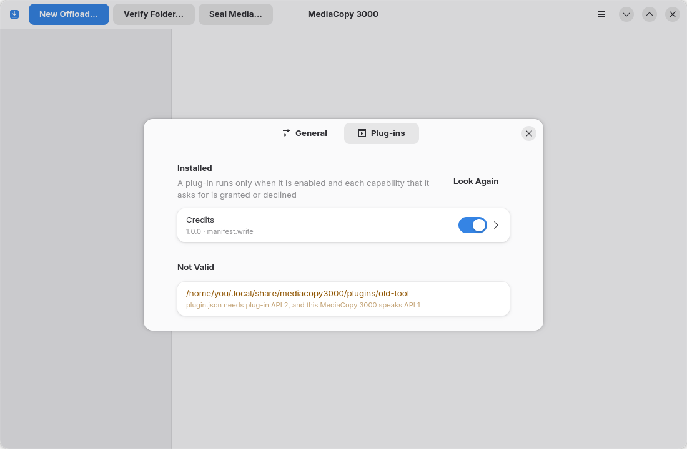

# Extensions

Une extension ajoute du travail à une tâche. C’est un programme séparé. MediaCopy 3000 le démarre
pour chaque tâche et lui envoie des messages.

Une extension ne modifie jamais un fichier de médias. Elle n’écrit jamais un manifeste. Elle donne
des données à MediaCopy 3000, qui les vérifie et les écrit.

## Ce qu’une extension peut faire

Une extension a un ou plusieurs rôles.

| Rôle | Quand il agit | Ce qu’il fait |
|---|---|---|
| Inspecteur | Quand le plan est fait, puis après la vérification de chaque fichier | Ajoute des constats au plan. Ajoute au rapport des notes sur chaque fichier. |
| Contributeur | Quand le plan est fait | Ajoute des auteurs et des métadonnées à chaque manifeste que la tâche écrit. |
| Producteur | Après la tâche | Écrit des fichiers, par exemple un rapport PDF. |
| Livreur | Après les producteurs | Envoie des fichiers, par exemple vers un serveur. |

La feuille du plan montre ce que les contributeurs ajoutent, dans le groupe **Enregistré dans le
manifeste**. Ce que vous approuvez avec **Démarrer** est ce que la tâche écrit. Ce qu’une extension
trouve après la copie va dans le rapport, jamais dans le manifeste.

## Installer une extension

Chaque extension a son propre dossier, nommé d’après son identifiant. Le dossier contient un fichier
`plugin.json` et le programme. L’identifiant est un nom de domaine inversé en minuscules, par
exemple `tech.floreal.c2pa-reader` : il ne contient que `a` à `z`, des chiffres, `.`, `-` et `_`, au
moins un `.` et aucun `..`, et il ne commence ni ne finit par `.`.

| Système | Dossier pour votre compte | Dossier pour tous les comptes |
|---|---|---|
| Linux | `~/.local/share/mediacopy3000/plugins/<id>/` | `mediacopy3000/plugins/<id>/` dans chaque dossier de `XDG_DATA_DIRS`, par exemple `/usr/share` |
| macOS | `~/Library/Application Support/MediaCopy3000/Plugins/<id>/` | Aucun. Le dossier dans l’application contient les extensions fournies avec MediaCopy 3000 : voir le tableau suivant. |
| Windows | `%APPDATA%\MediaCopy3000\plugins\<id>\` | `%PROGRAMDATA%\MediaCopy3000\plugins\<id>\` |
| Flatpak | `~/.var/app/tech.floreal.MediaCopy3000/data/mediacopy3000/plugins/<id>/` | L’extension Flatpak `tech.floreal.MediaCopy3000.Plugin.<id>` |

Les extensions fournies avec MediaCopy 3000 sont dans un autre dossier :

| Système | Dossier des extensions fournies avec MediaCopy 3000 |
|---|---|
| Linux | `lib/mediacopy3000/plugins/<id>/` à côté du dossier `bin` du programme, par exemple `/usr/lib/mediacopy3000/plugins/<id>/` |
| macOS | `MediaCopy3000.app/Contents/PlugIns/<id>/` |
| Windows | `%LOCALAPPDATA%\Programs\MediaCopy 3000\plugins\<id>\` |
| Flatpak | `/app/lib/mediacopy3000/plugins/<id>/` |

Si deux dossiers ont le même identifiant, le dossier de votre compte l’emporte, et le dossier des
extensions fournies avec MediaCopy 3000 perd. Vous pouvez donc installer pour votre compte une
version plus récente d’une telle extension.

La page **Extensions** (Plug-ins) des préférences liste chaque dossier d’extension non valide, avec
la raison, dans le groupe **Non valides** (Not Valid). `mediacopy3000 plan` écrit les mêmes raisons
sur la sortie d’erreur.

## Activer une extension



Une extension que vous installez est désactivée. Elle demande des capacités, et vous devez répondre
à chacune.

1. Ouvrez le menu principal et choisissez **Extensions** (Plug-ins).
2. Cliquez sur la ligne de l’extension pour la déplier.
3. Activez **Activée** (Enabled).
4. Pour chaque capacité, choisissez **Accordée** (Granted) ou **Refusée** (Declined).
5. Pour chaque réglage, tapez une valeur, puis cliquez sur le bouton d’application à droite de la
   ligne.

Pour effacer un réglage, appliquez une valeur vide, ou choisissez **Non défini** (Not set).
L’extension reçoit alors la valeur par défaut du réglage, s’il en a une. Les lignes montrent les
valeurs par défaut.

Une extension ne démarre que si chaque capacité qu’elle demande est accordée ou refusée. Une
nouvelle version qui demande une nouvelle capacité s’arrête jusqu’à votre réponse. Le sous-titre de
la ligne dit pourquoi une extension activée ne démarre pas.

Si vous ajoutez ou retirez un dossier d’extension pendant que les préférences sont ouvertes,
cliquez sur **Chercher à nouveau** (Look Again).

### Réglages secrets

Un réglage secret, par exemple un mot de passe ou un jeton, va dans le trousseau du système. Il ne
va jamais dans `plugins.json`.

| Système | Trousseau |
|---|---|
| Linux | Le Secret Service, par exemple GNOME Keyring ou KWallet |
| Flatpak | Le trousseau du bac à sable, par le portail Secret. Si le bureau n’a pas de portail Secret, le Secret Service. |
| macOS | Le trousseau (Keychain) |
| Windows | Le gestionnaire d’identification (Credential Manager) |

La ligne d’un secret gardé indique `stored in the keyring`. Le champ reste vide. Pour retirer le
secret, appliquez une valeur vide.

Si le trousseau refuse, par exemple parce qu’il est verrouillé, la ligne indique
`the keyring refused`, et le sous-titre de l’extension donne la raison. L’extension ne démarre pas.
Le plan donne le constat `plug-in unavailable`, avec la raison `the keyring refused: …`.

Si `plugins.json` contient un secret, la ligne indique `set in plugins.json`, et l’extension le
reçoit. Un secret du trousseau l’emporte. Appliquez le secret dans la ligne, puis retirez-le du
fichier.

### Le fichier `plugins.json`

MediaCopy 3000 garde vos réponses et les réglages dans le fichier `plugins.json`. Vous pouvez aussi
modifier ce fichier vous-même, par exemple pour installer les mêmes extensions sur plusieurs
ordinateurs.

1. Ouvrez le fichier `plugins.json`. Créez-le s’il n’existe pas.

   | Système | Chemin |
   |---|---|
   | Linux | `~/.config/mediacopy3000/plugins.json` |
   | macOS | `~/Library/Application Support/MediaCopy3000/plugins.json` |
   | Windows | `%APPDATA%\MediaCopy3000\plugins.json` |
   | Flatpak | `~/.var/app/tech.floreal.MediaCopy3000/config/mediacopy3000/plugins.json` |

2. Ajoutez une entrée pour l’extension :

   ```json
   {
     "plugins": {
       "tech.floreal.c2pa-reader": {
         "enabled": true,
         "grants": ["files.read"],
         "declined": ["block"],
         "settings": {}
       }
     }
   }
   ```

3. Mettez chaque capacité que l’extension demande dans `grants` ou dans `declined`.
4. Mettez une valeur pour chaque réglage de l’extension dans `settings`. Ne mettez aucun secret
   dans ce fichier.
5. Si les préférences sont ouvertes, cliquez sur **Chercher à nouveau** (Look Again).

Quand MediaCopy 3000 écrit `plugins.json`, il garde les clés qu’il ne connaît pas.

## Ce que MediaCopy 3000 impose

| Capacité | Ce qu’elle permet | Ce que MediaCopy 3000 impose |
|---|---|---|
| `files.read` | Lire les fichiers de médias | Rien. L’extension le promet. |
| `block` | Un inspecteur peut arrêter une tâche par un blocage | Sans cette capacité, un blocage de l’extension devient un avertissement. |
| `network` | Un livreur peut envoyer des fichiers sur le réseau | Seul un livreur peut la demander. MediaCopy 3000 n’empêche pas le programme d’ouvrir une connexion. |
| `manifest.write` | Un contributeur peut ajouter des données au manifeste | Sans cette capacité, MediaCopy 3000 ne demande pas de données à l’extension. |

Une extension est un programme qui tourne avec vos droits. MediaCopy 3000 ne peut pas l’empêcher de
lire un fichier ou d’ouvrir une connexion réseau. N’installez que des extensions d’une source de
confiance.

## Champs de tâche

Une extension peut demander une valeur pour chaque tâche, par exemple le nom du cadreur.

Dans la fenêtre, la fiche du plan montre le groupe **Champs de tâche** (Job Fields), avec une ligne
pour chaque champ de chaque extension activée. Tapez la valeur, puis cliquez sur le bouton
d’application. MediaCopy 3000 établit le plan à nouveau avec la valeur. La page
[Le plan](the-plan.md) montre ce groupe.

Sur la ligne de commande, donnez la valeur avec `--plugin-field` :

```
mediacopy3000 plan offload SOURCE DEST --plugin-field tech.floreal.credits.operator="Sam Roe"
```

Si un champ de tâche obligatoire n’a pas de valeur, le plan donne le constat
`le champ operator n’a pas de valeur valide`. Pour un contributeur, et pour un inspecteur qui a la
capacité `block`, ce constat est un blocage. Pour toute autre extension, c’est un avertissement, et
l’extension ne s’exécute pas.

## Quand une extension échoue

Une extension échoue quand elle ne démarre pas, s’arrête, envoie une réponse invalide, ne lit pas
une requête, écrit une ligne de plus de 16 Mio, ou ne donne aucun signe de vie pendant 30 secondes.
Une tâche longue n’échoue pas tant que l’extension signale son avancement.

| Quand | Extension | Résultat |
|---|---|---|
| Le plan est fait | Contributeur, ou inspecteur avec la capacité `block` | Un blocage. **Démarrer** reste grisé. |
| Le plan est fait | Toute autre extension | Un avertissement. L’extension ne prend pas part à la tâche. |
| Le plan est bloqué | Toutes | Aucune extension ne démarre pour la tâche. |
| Un fichier est inspecté | Inspecteur | MediaCopy 3000 redémarre l’extension et renvoie le même fichier. Après un second échec, les fichiers restants sont `non inspectés`. Le résultat de la tâche ne change pas. |
| Après la tâche | Producteur ou livreur | Un avertissement dans le rapport. Le résultat de la tâche ne change pas. |

Quand vous annulez une tâche, MediaCopy 3000 arrête chaque extension, et les programmes qu’elle a
lancés, en 3 secondes au plus. Les producteurs et les livreurs ne s’exécutent pas.

## Les fichiers que produisent les extensions

Un producteur écrit dans un dossier à côté du [journal des événements](event-log.md) de la tâche :

```
~/.local/state/mediacopy3000/jobs/<tâche>/artifacts/<id>/
```

MediaCopy 3000 ne met jamais ces fichiers dans une destination. Un fichier absent de la source dans
une destination bloque le prochain déchargement vers ce dossier.

Le [rapport](reports.md) liste chaque fichier produit et chaque livraison.

## Écrire une extension

Une extension lit des messages sur son entrée standard et écrit ses réponses sur sa sortie standard.
Chaque message est un objet JSON-RPC 2.0 sur une ligne. MediaCopy 3000 envoie ces requêtes :

| Méthode | Quand |
|---|---|
| `initialize` | En premier. Elle donne les réglages, les champs de tâche et les capacités accordées. |
| `inspect/plan` | Quand le plan est fait, à un inspecteur |
| `contribute` | Quand le plan est fait, à un contributeur |
| `inspect/file` | Après chaque fichier vérifié, à un inspecteur |
| `export/produce` | Après la tâche, à un producteur |
| `export/deliver` | Après les producteurs, à un livreur |
| `shutdown` | En dernier |

L’extension peut envoyer les notifications `$/progress` et `$/log`. Les lignes de sa sortie
d’erreur vont dans le journal des événements de la tâche.

Une extension doit respecter ces règles :

- Elle s’arrête quand son entrée standard se ferme.
- Elle lit chaque requête. MediaCopy 3000 arrête une extension qui ne lit pas une requête dans le
  délai de l’appel.
- Elle écrit des lignes de 16 Mio au plus.
- Elle donne la même réponse à `inspect/plan` et `contribute` pour la même tâche. MediaCopy 3000
  refait le plan d’une tâche en attente quand vient son tour, et une réponse différente renvoie la
  tâche en révision.
- Elle n’écrit des métadonnées que dans l’espace de noms XML que déclare son `plugin.json`. Cet
  espace de noms ne peut pas être vide, un espace de noms d’ASC MHL, ou un espace de noms que XML
  réserve. Les métadonnées ont au plus 32 niveaux d’éléments, et seulement des caractères que
  XML 1.0 autorise. MediaCopy 3000 retire les commentaires XML et les instructions de traitement.
- Elle n’écrit dans un auteur que des caractères que XML 1.0 autorise.
- Elle écrit ses fichiers dans `outputDir`. Un chemin dans sa réponse peut être absolu, ou relatif à
  `outputDir`. Un nom de fichier qui contient un caractère de contrôle, comme un saut de ligne, est
  refusé.
- Chaque chemin de `executable` est relatif au dossier de l’extension. Il ne commence ni par `/` ni
  par `\`, ne contient pas de `:` et n’a pas de partie `..`. Un seul mauvais chemin, pour n’importe
  quel système, rend l’extension non valide sur tous les systèmes.

MediaCopy 3000 remplace par une espace chaque caractère de contrôle et chaque saut de ligne d’un
texte qui vient d’une extension, comme un titre, un libellé ou une ligne du journal.

Le journal des événements d’une tâche contient au plus 1 024 lignes en attente d’écriture. Tant
qu’il est plein, les nouvelles lignes sont perdues, celles de MediaCopy 3000 aussi. Une extension
qui écrit beaucoup de lignes à la fois peut donc faire perdre des lignes au journal.

### Tracer les messages

Pour voir chaque message entre MediaCopy 3000 et une extension, activez **Tracer les messages**
(Trace Messages) dans la ligne de l’extension. La clé `"trace": true` dans `plugins.json` fait la
même chose.

Chaque démarrage de l’extension crée alors un fichier dans ce dossier :

| Système | Chemin |
|---|---|
| Linux, macOS | `~/.local/state/mediacopy3000/plugin-traces/` |
| Windows | `%LOCALAPPDATA%\mediacopy3000\plugin-traces\` |
| Flatpak | `~/.var/app/tech.floreal.MediaCopy3000/.local/state/mediacopy3000/plugin-traces/` |

Le nom du fichier est `<id>-<date>_<heure>-<étape>-<pid>.jsonl`. L’étape est `plan` ou `run`. Une
extension que MediaCopy 3000 redémarre reçoit un nouveau fichier.

Chaque ligne du fichier est un objet JSON :

- `time` : l’heure en UTC, à la milliseconde.
- `dir` : `out` pour un message vers l’extension, `in` pour une ligne de sa sortie standard,
  `stderr` pour une ligne de sa sortie d’erreur.
- `message` : la ligne, si elle est en JSON. Sinon, `text` contient la ligne sous forme de texte.

Dans `initialize`, la valeur de chaque réglage secret est `<redacted>`. Les autres réglages sont en
clair.

MediaCopy 3000 ne supprime pas les fichiers de trace. Désactivez **Tracer les messages** quand vous
n’en avez pas besoin. Une trace qui ne peut pas être écrite ajoute une ligne au journal des
événements de la tâche, et l’extension continue.

## Distribuer une extension

Donnez l’extension sous la forme d’un dossier qui contient `plugin.json` et les programmes pour
chaque système qu’elle prend en charge. Le nom du dossier est l’identifiant de l’extension.

Pour la version Flatpak de MediaCopy 3000, distribuez l’extension comme une extension Flatpak :

1. Donnez à l’extension Flatpak l’identifiant `tech.floreal.MediaCopy3000.Plugin.<id>`, par exemple
   `tech.floreal.MediaCopy3000.Plugin.tech.floreal.c2pa-reader`.
2. Installez `plugin.json` et le programme à la racine de l’extension Flatpak.
3. Compilez le programme pour l’environnement d’exécution `org.gnome.Platform`, version 49.

Un identifiant Flatpak n’accepte le caractère `-` que dans sa dernière partie, et aucune partie ne
peut commencer par un chiffre. Si l’identifiant de l’extension ne respecte pas ces règles, il ne
peut pas être le nom d’une extension Flatpak. Distribuez alors le dossier, et dites à la personne de
le mettre dans le dossier de son compte.

L’extension apparaît dans le bac à sable comme le dossier `/app/share/mediacopy3000/plugins/<id>/`.
L’environnement d’exécution contient Python 3. Un programme en Python peut donc tourner sans autre
fichier.
