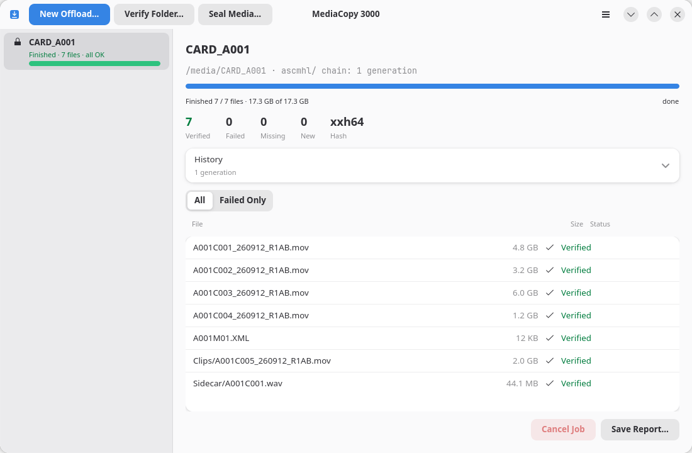

# Sceller une source multimédia

Une opération de scellement (« seal ») lit un dossier, calcule l'empreinte
(hash) de chaque fichier et écrit le résultat dans un sous-dossier nommé
`ascmhl` situé à l'intérieur de ce même dossier. Aucun fichier n'est copié ni
déplacé.

## Lancer une opération

1. Cliquez sur **Sceller le média…** (Seal Media…) ou appuyez sur <kbd>Ctrl</kbd>+<kbd>L</kbd>.
2. Sélectionnez la source multimédia.
3. Lisez le plan, puis cliquez sur **Démarrer** (Start).

## Pourquoi sceller ?

Un scellement fournit un point de comparaison pour une opération de transfert
ultérieure. Sans lui, un transfert peut seulement prouver que chaque copie
correspond à ce qui a été lu sur la source multimédia. Avec lui, il est possible
de prouver que ce qui a été lu correspond toujours à ce qui était présent au
moment du scellement initial.

Une opération de scellement écrit des données sur la source multimédia. C'est
également le cas d'un transfert effectué avec l'option **Sceller la source
multimédia d'abord** (Seal the media source first) activée, car cette option
exécute la même opération de scellement. Toutes les autres tâches laissent la
source dans l'état où elles l'ont trouvée.

Si la source multimédia est protégée en écriture, ou si vous ne souhaitez rien y inscrire, ne la scellez pas et laissez cette option désactivée. Chaque fichier sera alors enregistré comme `original`.

## Ce qui est enregistré

Un scellement enregistre chaque fichier comme `original`, car il s'agit
des premières empreintes calculées pour ces fichiers. L'opération utilise
l'algorithme `xxh64` pour un dossier ne contenant aucun historique. Pour un
dossier en contenant déjà un, elle utilise le format de l'historique existant.

La génération enregistre le processus effectué « sur place » (*in-place*).

## Sceller un dossier déjà scellé

Le plan affiche un avertissement indiquant que le « dossier est déjà scellé
» et précise la génération qu'il contient déjà. La tâche peut tout de même
être exécutée. Elle écrit une seconde génération indiquant que les fichiers
produisent toujours les mêmes empreintes ; il s'agit, dans les faits, d'une
vérification.

Pour cette opération, utilisez plutôt **Vérifier le dossier…** (Verify Folder…).
Cette commande reflète plus fidèlement votre intention.
