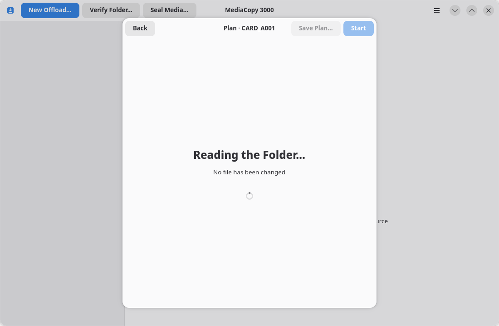
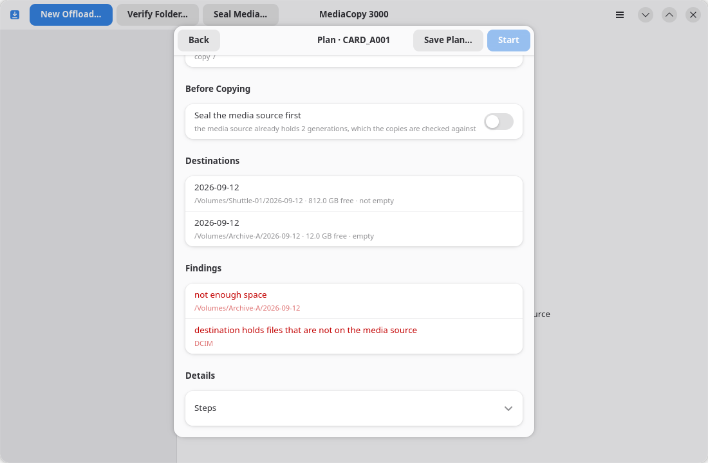
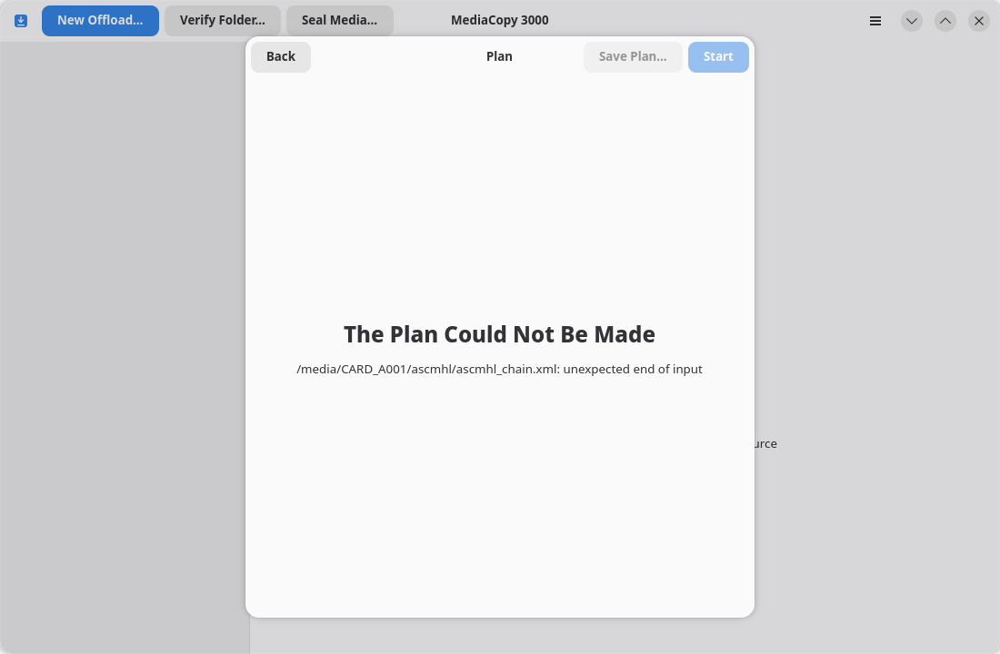

# Le plan

La fiche de plan indique ce qu'une tâche va accomplir avant même de l'exécuter.

Toutes les tâches passent par cette étape : un transfert (offload) après avoir
cliqué sur **Review Plan…** (Examiner le plan), ou une vérification/scellement
dès la sélection du dossier.

## Pendant la lecture

La fiche affiche « Lecture du dossier… » et « Aucun fichier modifié ». L'analyse d'une source contenant de nombreux fichiers peut prendre quelques secondes.

## Une fois prêt

Cette fiche se compose de quatre groupes :

### Cette tâche

| Ligne | Signification |
|---|---|
| `7 files` | Nombre de fichiers que la tâche va traiter. Le sous-titre indique le poids total (en octets) de ces fichiers ; ce calcul n'inclut pas l'étape de scellement. |
| `Hash format` | Le format de hachage unique utilisé par la tâche, ainsi que l'origine des fichiers sources. |
| `Steps` | Les actions que la tâche effectuera, classées par type : `copie`, `manquant`, `écrasement`, `enregistrement`, `réutilisation`, `vérification`. La fiche les liste par ordre alphabétique. |

Une tâche adopte un format de hachage unique pour tous les fichiers. Elle
détermine ce format à partir des enregistrements de référence. En l'absence
d'indication spécifique, elle utilise `xxh64`.

`missing` : compte les fichiers présents dans l'historique mais absents du disque.

`reuse` : compte les fichiers déjà présents sur toutes les destinations avec
la taille correcte. La tâche calcule le hash de chacun et ne le copie que
si le hash diffère. `écrasement` : compte les fichiers que la tâche copie
par-dessus un fichier déjà présent sur une destination. Un fichier présent sur
une destination mais absent d'une autre est comptabilisé comme `copie`. Tant que
vous n'avez pas choisi **Resume** ou **Replace**, le décompte affiche le
cas **Replace**.

### Avant la copie

Ce groupe concerne uniquement les transferts (offloads). Il contient les deux
options expliquées sur la page [Sceller d'abord la source](seal-first.md). Il
affiche également la ligne **Copie existante** lorsqu'une destination contient
une copie partielle.

### Destinations

Une ligne par destination : le chemin complet, l'espace libre et l'état du dossier.

| État | Signification |
|---|---|
| `empty` | Le dossier existe et est vide. |
| `not empty` | Le dossier contient un fichier, un sous-dossier ou une génération absents de la source multimédia. Cela constitue un blocage. |
| `will be created` | Le dossier n'existe pas encore. La tâche le créera. |
| `partial copy` | Le dossier contient certains fichiers de cette source multimédia et rien d'autre. Vous devez choisir **Reprendre** ou **Remplacer**. |

### Constats

Un constat est une information importante relevée par le plan. Les blocages
apparaissent en premier, suivis des avertissements.

- Un **blocage** interrompt la tâche. Le bouton **Démarrer** reste grisé tant qu'un blocage est présent.
- Un **avertissement** n'interrompt rien. Prenez-en connaissance et décidez de la marche à suivre.

La page [Constats](findings.md) répertorie tous les constats possibles et les actions à entreprendre pour chacun d'eux.

## Lorsque le plan ne peut pas être établi

La fiche indique la raison de l'échec. La cause la plus fréquente est
l'impossibilité de lire un fichier de chaîne. Aucune modification n'a été
apportée aux disques.

## Démarrer ou revenir en arrière

**Démarrer** ajoute la tâche à la liste et l'exécute, ou la place en file d'attente si une autre tâche est déjà en cours.

**Retour** annule le plan sans rien modifier. La touche `Échap` et le bouton de fermeture produisent le même effet.

## Enregistrer le plan

**Enregistrer le plan…** permet d'enregistrer la fiche du plan sous forme de
fichier texte. Cette option est disponible une fois le plan prêt. Le fichier
contient le même bloc `Plan` que celui présent dans un rapport enregistré.
Joignez-le à tout signalement de problème.

## Relecture du plan

Une seule tâche s'exécute à la fois. Une tâche en attente est replanifiée
lorsqu'elle arrive en tête de file, car l'état du disque peut changer pendant
l'attente.

Si le nouveau plan est identique à celui que vous avez approuvé, la tâche
s'exécute. Si ce n'est pas le cas, la tâche passe au statut « À réviser » et le
nouveau plan revient sur cette feuille pour que vous le validiez à nouveau.
